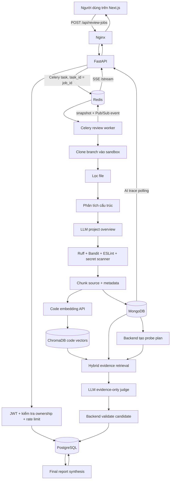

# Luồng hoạt động đầy đủ của AI Pipeline trong RepoGuard AI

> Tài liệu này mô tả **implementation hiện tại trong mã nguồn**, không chỉ mô tả ý tưởng kiến trúc. Nội dung được đối chiếu với code tại ngày 10/08/2026. Nếu code thay đổi, nên cập nhật lại tài liệu này cùng commit.

## 1. RepoGuard AI làm gì?

RepoGuard AI là hệ thống review source code theo mô hình bất đồng bộ. Người dùng đăng ký một repository GitHub/GitLab, tạo review job, theo dõi tiến độ thời gian thực, rồi xem báo cáo, issue, bằng chứng source và trace của AI.

Điểm quan trọng nhất: hệ thống **không gửi toàn bộ repository vào một prompt duy nhất**. Pipeline thực hiện nhiều lớp xử lý:

1. Clone đúng branch vào sandbox riêng.
2. Lọc file an toàn và có ích.
3. Phân tích cấu trúc repository.
4. Sinh project overview bằng LLM; bước này không chặn review nếu thất bại.
5. Chạy Ruff, Bandit, ESLint và secret scanner.
6. Chia source thành các chunk có metadata.
7. Lưu chunk vào MongoDB và tạo embedding/cache trong ChromaDB.
8. Backend tự lập các câu hỏi kiểm tra gọi là **probe**.
9. Backend tìm các chunk có khả năng liên quan bằng semantic search, BM25, exact match và structural match.
10. LLM chỉ đánh giá các evidence bundle đã được backend chọn.
11. Backend hậu kiểm output của LLM trước khi cho phép tạo issue.
12. Hợp nhất static issue và AI issue theo canonical finding/occurrence, rồi sinh báo cáo cuối không dùng thang điểm 0–10.
13. Gửi trạng thái qua Redis Pub/Sub và SSE để frontend cập nhật thời gian thực.

## 2. Sơ đồ tổng quan end-to-end



## 3. Các thuật ngữ và khái niệm cần biết

| Thuật ngữ | Giải thích trong hệ thống này |
|---|---|
| Review job | Một lần review cụ thể của một repository, branch và commit. Job có UUID, trạng thái, options, thời điểm bắt đầu/kết thúc. |
| Pipeline | Chuỗi bước có thứ tự, trong đó output của bước trước trở thành input hoặc điều kiện cho bước sau. |
| Worker | Process Celery chạy tác vụ nặng ngoài request HTTP để API không phải chờ hàng phút. |
| Broker | Redis đóng vai trò trung gian nhận task từ FastAPI và giao cho Celery worker. |
| Sandbox | Thư mục tạm riêng cho từng job, có dạng `<SANDBOX_ROOT>/<job_id>`, chứa bản clone source. |
| Static analysis | Phân tích bằng rule cố định, không cần LLM: Ruff, Bandit, ESLint, secret scanner. |
| Normalization | Đổi output khác nhau của từng analyzer về cùng schema `NormalizedIssue`. |
| Chunk | Một phần source có giới hạn kích thước và vị trí dòng, thường là function, class, module hoặc cửa sổ dòng. |
| Token | Đơn vị gần đúng mà model xử lý. Code dùng bộ đếm nhẹ để giới hạn chunk/batch; con số này không nhất thiết bằng tokenizer thật của provider. |
| Embedding | Vector số biểu diễn ý nghĩa của text/code. Các nội dung gần nghĩa có vector gần nhau. |
| Vector search | Tìm chunk theo độ gần embedding thay vì chỉ trùng từ khóa. |
| ChromaDB | Vector database cục bộ lưu vector của knowledge base và source code trong các collection tách biệt. |
| RAG | Retrieval-Augmented Generation: tìm evidence trước, rồi đưa evidence vào LLM để giảm đoán mò. |
| BM25 | Thuật toán xếp hạng theo từ khóa, ưu tiên từ quan trọng và độ hiếm của từ trong corpus. |
| Exact match | Chấm điểm theo tỷ lệ từ quan trọng trong query xuất hiện trong path/content. |
| Structural match | Matcher dựa trên cấu trúc/pattern code, ví dụ SQL injection, command injection, auth, race condition, N+1. |
| RRF | Reciprocal Rank Fusion: hợp nhất nhiều bảng xếp hạng mà không buộc score của các chiến lược phải cùng thang đo. |
| Probe | Một câu hỏi review hẹp, ví dụ “request-controlled data có đi vào raw SQL không?”. Probe có lane, category, priority, query và câu hỏi cho judge. |
| Lane | Nhóm mục tiêu của probe: `defect`, `coverage`, hoặc `roadmap`. Các lane không bị trộn trong cùng judge batch. |
| Candidate chunk | Chunk có khả năng chứa bằng chứng cho một probe. |
| Evidence bundle | Một probe cộng danh sách candidate chunk đã được chọn và giới hạn theo budget. |
| Judge | LLM đánh giá evidence bundle và trả JSON gồm `issue`, `no_issue` hoặc `uncertain`. |
| Grounding | Ràng buộc kết luận vào file, chunk và dòng source thực sự đã được cung cấp. |
| Confidence | Độ tin cậy từ 0 đến 1. AI issue chỉ được lưu khi confidence tối thiểu là `0.7`. |
| Roadmap profile | Bộ 79 yêu cầu trong `roadmap_rules_v2.yaml`, có thể giới hạn theo tuần. Frontend hiện bật profile này khi tạo job. |
| Knowledge base | Collection `knowledge_base` chứa tài liệu chuẩn và roadmap, dùng embedding cục bộ 384 chiều. |
| Code index | Collection code vector riêng theo provider/model, mặc định vector 1536 chiều từ Codestral Embed. |
| Manifest | Document mô tả trạng thái một lần tạo code index: `BUILDING`, `INDEXED` hoặc `FAILED`. |
| SSE | Server-Sent Events: kết nối HTTP một chiều từ backend tới browser để đẩy tiến độ. |
| Trace | Timeline lưu các lần embedding, retrieval, LLM call, judge và report synthesis. |
| Idempotency/cache identity | Cách tạo ID xác định từ repo, branch, commit, content và model để tái sử dụng embedding đúng scope. |
| Circuit breaker | Cơ chế dừng gọi LLM khi vượt call budget hoặc gặp transient failure không hồi phục, tránh retry vô hạn. |

## 4. Các thành phần và trách nhiệm

### 4.1 Frontend — Next.js

- Tạo repository và review job qua REST.
- Giữ trạng thái UI bằng Redux.
- Mở native `EventSource` tới `stream_url` để nhận tiến độ.
- Poll AI trace mỗi 4 giây khi job đang chạy.
- Nếu SSE mất kết nối, refresh session; đồng thời GET job mỗi 10 giây để hòa giải trạng thái.
- Đóng SSE khi nhận event `completed` hoặc `failed`.

Code chính:

- `frontend/src/lib/review-jobs.ts`
- `frontend/src/lib/job-progress.ts`
- `frontend/src/hooks/use-job-progress.ts`
- `frontend/src/app/reviews/[id]/page.tsx`

### 4.2 Nginx

- Route `/api/*` tới FastAPI.
- Route các URL còn lại tới Next.js.
- Riêng SSE tắt proxy buffering và cache để event đến browser ngay.
- Cấu hình hiện vẫn có `/ws/`, nhưng pipeline tiến độ hiện dùng SSE, không dùng WebSocket.

### 4.3 FastAPI

- Xác thực access token từ Bearer header hoặc HttpOnly cookie.
- Kiểm tra token blacklist và user còn active.
- Kiểm tra ownership của repository/job/report/trace.
- Rate limit tạo review job: 10 request/user/60 giây.
- Tạo record `PENDING` trong PostgreSQL và enqueue Celery task.
- Cung cấp REST API, SSE stream, report, issue, summary và trace.

### 4.4 Celery worker và Celery Beat

- Worker chạy toàn bộ pipeline nặng.
- Task ID chính là `job_id`, giúp revoke khi cancel.
- Worker dùng `asyncio.run()` để chạy luồng async bên trong Celery task sync.
- Celery Beat chạy cleanup sandbox mỗi 30 phút.

### 4.5 PostgreSQL

Lưu dữ liệu quan hệ và kết quả nghiệp vụ cần tính nhất quán:

- `users`
- `repositories`
- `review_jobs`
- `job_status_history`
- `review_reports`
- `review_issues`
- auth/refresh token data

### 4.6 MongoDB

Lưu artifact lớn, linh hoạt và trace:

| Collection | Nội dung |
|---|---|
| `file_analysis_results` | Cấu trúc project, flat file tree, số dòng/kích thước file. |
| `repo_summary_results` | Project overview do LLM sinh, theo repository/job/commit. |
| `raw_static_analysis_outputs` | stdout, stderr, exit code và parsed issue của từng analyzer. |
| `chunk_metadata` | Source chunk đầy đủ cùng path, line range, risk area, hash/cache metadata. |
| `code_index_manifests` | Trạng thái lifecycle của code vector index. |
| `tool_call_logs` | Event embedding, LLM call, probe retrieval, probe judge, roadmap catalog, final report. |

### 4.7 Redis

Redis có bốn vai trò:

1. Celery broker.
2. Celery result backend.
3. Pub/Sub cho tiến độ job.
4. Snapshot tiến độ cuối và auth token blacklist/rate limit.

### 4.8 ChromaDB

Có hai nhóm collection độc lập:

- `knowledge_base`: tài liệu OWASP, PEP, style guide, FastAPI và roadmap; mặc định embedding local `sentence-transformers/all-MiniLM-L6-v2`, 384 chiều.
- `code_chunks_<provider>_<model>`: source code của repository; mặc định provider `mistral`, model `codestral-embed-2505`, 1536 chiều.

Không được trộn hai loại vector vì chúng khác model, dimension và ý nghĩa.

## 5. Luồng từ lúc người dùng bấm “Start review”

### 5.1 Đăng ký repository

Frontend gọi:

```http
POST /api/repositories
Content-Type: application/json

{
  "name": "example",
  "url": "https://github.com/org/example.git",
  "default_branch": "main"
}
```

Backend chỉ chấp nhận URL HTTP/HTTPS trên `github.com` hoặc `gitlab.com`. Trường `platform` trong request không quyết định platform; service tự nhận diện từ hostname. Mọi repository gắn với `user_id` của người tạo.

### 5.2 Tạo review job

Frontend hiện gửi roadmap profile mặc định:

```http
POST /api/review-jobs
Content-Type: application/json

{
  "repository_id": "<uuid>",
  "branch": "main",
  "options": {
    "rule_profile": {
      "id": "roadmap_bootcamp_v1"
    }
  }
}
```

API thực hiện theo thứ tự:

1. Xác thực user.
2. Áp rate limit.
3. Tìm repository trong PostgreSQL.
4. Từ chối nếu repository không thuộc user.
5. Dùng branch từ request; nếu rỗng thì dùng `default_branch`.
6. Tạo `review_jobs.status=PENDING` và history `Job created`, progress `0`.
7. Commit PostgreSQL.
8. Gọi `process_review_job.apply_async(args=[job_id], task_id=job_id)`.
9. Trả HTTP `201` với `job_id`, `PENDING`, `created_at`, `stream_url`.

Response mẫu:

```json
{
  "job_id": "7c6c...",
  "status": "PENDING",
  "created_at": "2026-07-29T10:00:00Z",
  "stream_url": "/api/review-jobs/7c6c.../stream"
}
```

### 5.3 Worker nhận task

Worker tạo dependency theo phạm vi một task:

- SQLAlchemy `AsyncSession`.
- MongoDB database.
- `ReviewJobRepository`, `RepositoryRepository`, `ReportRepository`.
- Các Mongo repository.
- Code embedding store hoặc disabled store.
- `CodeIndexingService`.
- `ReviewPipelineService`.

Nếu semantic search bật nhưng Chroma/provider/model không khởi tạo được, worker đánh dấu job `FAILED` ngay trước khi pipeline chính chạy.

## 6. State machine và phần trăm tiến độ

| Mốc | Status | Progress | Thao tác |
|---:|---|---:|---|
| 0 | `PENDING` | 0 | Job được tạo và enqueue. |
| 1 | `CLONING` | 10 | Bắt đầu clone. |
| 2 | `CLONING` | 20 | Clone xong, đã có commit SHA. |
| 3 | `ANALYZING_STRUCTURE` | 35 | Bắt đầu map project. |
| 4 | `ANALYZING_STRUCTURE` | 45 | Đã lưu structure/file tree. |
| 5 | `GENERATING_SUMMARY` | 50 | Bắt đầu project overview. |
| 6 | `GENERATING_SUMMARY` | 55 | Summary xong hoặc lỗi nhưng tiếp tục. |
| 7 | `RUNNING_STATIC_ANALYSIS` | 60 | Bắt đầu static analyzers. |
| 8 | `RUNNING_STATIC_ANALYSIS` | 75 | Đã chạy đủ ba adapter. |
| 9 | `CHUNKING_CODE` | 80 | Bắt đầu chunk/index. |
| 10 | `CHUNKING_CODE` | 84 | Chunk và code index sẵn sàng. |
| 11 | `AI_REVIEWING` | 88 | Bắt đầu probe review. |
| 12 | `AI_REVIEWING` | 89–94 | Tăng theo số judge batch hoàn tất. |
| 13 | `GENERATING_REPORT` | 95 | Final AI report đã tồn tại và được xác nhận. |
| 14 | `COMPLETED` | 100 | Pipeline hoàn tất. |
| lỗi | `FAILED` | 100 | Lỗi blocking; `error_message` được lưu. |

Lưu ý:

- Các lần `_transition()` được ghi vào PostgreSQL `job_status_history`.
- Các mốc chỉ `_publish_status()` như 20, 45, 55, 75, 84 và batch 89–94 chủ yếu đi qua Redis/SSE, không tạo đầy đủ history row tương ứng.
- Redis publish là best effort. Redis lỗi khi publish không làm pipeline fail; frontend còn REST reconciliation.

## 7. Chi tiết từng bước của worker pipeline

### 7.1 Kiểm tra job còn tồn tại

Trước các bước quan trọng, pipeline query PostgreSQL. Nếu row job đã bị xóa do cancel, pipeline ném `ReviewJobCanceled` và dừng mà không đổi sang `FAILED`.

### 7.2 Clone repository

Lệnh tương đương:

```text
git clone --depth 1 --branch <branch> --single-branch <url> <sandbox/job_id>
```

Cơ chế bảo vệ:

- Dọn sandbox cũ chỉ khi path thực sự nằm dưới sandbox root.
- `GIT_TERMINAL_PROMPT=0`, không cho Git treo để chờ nhập credential.
- Timeout clone 120 giây.
- Clone nông một commit, một branch.
- Sau clone, tính tổng dung lượng và từ chối nếu lớn hơn `MAX_REPO_SIZE_MB`, mặc định 500 MB.
- Chạy `git rev-parse HEAD`, lưu `commit_sha` vào PostgreSQL.

Nếu clone thất bại, UI chỉ nhận thông báo an toàn `Repository does not exist or is private.`; stderr Git chi tiết không bị lộ ra response. Code hiện không có credential manager riêng cho private repository, không clone submodule và không xử lý Git LFS riêng.

### 7.3 Xây file manifest

Pipeline ưu tiên `git ls-files -z --cached`, do đó chỉ review file đã được Git track. Nếu không dùng được Git manifest thì fallback sang `os.walk`.

File bị loại khi:

- Nằm trong `.git`, cache, `build`, `dist`, `node_modules`, `venv`, `.venv`.
- Là symlink.
- Lớn hơn `MAX_SOURCE_FILE_SIZE_BYTES`, mặc định 1 MiB.
- Có extension binary đã biết hoặc 4 KiB đầu chứa null byte.
- Resolve ra ngoài sandbox root.

Danh sách cuối được sort ổn định theo path POSIX.

### 7.4 Phân tích cấu trúc

`analyze_structure()` tạo:

- Số file theo language dựa trên extension.
- Primary language.
- Framework đơn giản từ `package.json`, `requirements.txt`, `pyproject.toml`: Node, Next.js, React, Express, Python, FastAPI, Django, Flask.
- Nested file tree.
- Flat file tree gồm path, language, byte size, line count, `should_review=true`.

Kết quả lưu vào MongoDB `file_analysis_results`.

### 7.5 Sinh repository summary

Đây là LLM call độc lập nhằm tạo **project overview**, không phải review issue.

Prompt chỉ chứa:

- Metadata structure.
- File tree tối đa depth 3 và 200 dòng.
- Root README đầu tiên tìm thấy.
- `package.json`, `requirements.txt`, `pyproject.toml`, `docker-compose.yml` nếu có.
- Mỗi context file tối đa 12.000 ký tự.

Các giá trị giống secret trong context file được mask trước khi gửi. LLM phải trả JSON theo `RepoSummary`: purpose, project type, tech stack và architecture overview. Service thử tối đa hai vòng ở tầng summary.

Nếu summary thất bại:

- Log exception.
- Publish “Repository summary generation failed; continuing review”.
- Không fail toàn job.

Summary được lưu trong `repo_summary_results` và hiển thị ở trang repository. **Summary này hiện không được đưa vào probe plan hoặc judge prompt.**

### 7.6 Static analysis

Ba adapter chạy tuần tự:

| Tool | Input | Mục tiêu | Mapping mặc định |
|---|---|---|---|
| Ruff | `.py` | Lint/style Python | category `style`, severity `low`, confidence `0.9`. |
| Bandit | `.py` | Security Python | category `security`, severity từ Bandit, confidence 0.6/0.75/0.9. |
| ESLint | JS/TS/JSX/TSX | Lint frontend | category `style`, error→`medium`, còn lại→`low`, confidence `0.85`. |

Sau đó secret scanner tự đọc mọi filtered text file và tìm:

- AWS access key.
- Private key header.
- Generic API key/token/secret.
- Hardcoded password.

Secret finding có severity `critical`, category `security`, source `secret_scanner`, confidence `0.95`.

Mỗi analyzer lưu raw stdout/stderr, exit code, duration và parsed issue vào MongoDB. Output được normalize về schema chung:

```text
file_path, line_start, line_end, severity, category,
title, description, suggestion, source, confidence, raw_output
```

Pipeline còn gắn khoảng hai dòng source trước/sau issue vào `raw_output.source_context` để UI vẫn hiển thị evidence sau khi sandbox bị xóa.

Nếu executable analyzer thiếu hoặc timeout, adapter trả exit code `127` hoặc `124`; code hiện vẫn lưu raw run và tiếp tục, thay vì fail toàn job.

### 7.7 Chunk source

#### Python

- Parse bằng `ast`.
- Tạo chunk theo class, function/async function và phần module chưa được phủ.
- Một class có thể tạo cả class chunk và các method chunk; bước retrieval sẽ loại các chunk lồng nhau khi cần.
- Nếu syntax error hoặc không có AST candidate, fallback sang cửa sổ 60 dòng, overlap 10 dòng.
- Nếu chunk vượt khoảng 1.500 token ước lượng, tiếp tục chia theo cửa sổ dòng.

#### File không phải Python

- Chia theo cửa sổ dòng giới hạn khoảng 1.500 token, overlap 10 dòng.
- Markdown chỉ giữ root README (`README.md`/`README.markdown`); Markdown tài liệu thông thường không vào code chunks.

#### Metadata của mỗi chunk

- `file_path`, `language`, `chunk_type`.
- `chunk_index`, `total_chunks`.
- `function_name`, `class_name`, imports, module.
- `line_start`, `line_end`, token count.
- `risk_area`: `security`, `database`, `api`, `config`, hoặc `general`.
- `has_static_issues` nếu line range giao với static issue.
- `chunk_text` đầy đủ.

Risk area được suy ra từ path, filename và import. Ví dụ `auth/`, `security/`, `jwt` → security; `repositories/`, `sqlalchemy` → database; `routers/`, `api/` → api.

### 7.8 Lưu chunk và tạo code embedding

Trước khi embed, hệ thống tạo các khóa:

```text
repo_branch_key = SHA256(repository_id + NUL + branch)
index_generation_key = SHA256(repo_branch_key + NUL + commit_sha)
content_hash = SHA256(chunk_text)
embedding_cache_id = SHA256(
    generation + path + content_hash + occurrence + provider + model
    + model_version + dimension + chunker_version
)
```

Mục đích:

- Cô lập repository/branch/commit.
- Reuse vector nếu đúng cache ID.
- Embed lại chunk đã đổi nội dung.
- Không nhầm vector giữa model/dimension/chunker version.

Luồng index:

1. Ghi manifest `BUILDING`.
2. Xóa chunk metadata cũ của cùng job và insert MongoDB theo batch, mặc định 500 document.
3. Tìm vector cache hiện có trong đúng generation.
4. Refresh metadata cho cache hit.
5. Chỉ gửi chunk cache miss tới embedding API.
6. Batch tối đa 16 item, 12.000 token/batch và 1.500 token/item theo mặc định.
7. Upsert vector vào ChromaDB.
8. Xóa stale vector ID trong generation đang xử lý.
9. Ghi manifest `INDEXED` và embedding trace.

Embedding client gọi API tương thích OpenAI, hỗ trợ provider `openai`, `mistral`, `openrouter`; retry HTTP 429/5xx với `Retry-After` hoặc exponential backoff.

Chunk chứa pattern secret độ tin cậy cao bị loại khỏi **remote embedding call**. `skipped_sensitive_count` được tính trong summary nội bộ, nhưng chunk vẫn tồn tại trong MongoDB để static/lexical processing.

Nếu embedding/index lỗi, manifest thành `FAILED` và toàn review job fail. Nếu `ENABLE_CODE_SEMANTIC_SEARCH=false`, disabled store không tạo vector và semantic search trả rỗng; các chiến lược lexical/structural vẫn có thể hoạt động.

Tuy nhiên, AI phase hiện vẫn gọi `validate_rag_dependencies()` trước khi review. Vì vậy tắt code semantic search không đồng nghĩa có thể bỏ cài đặt `chromadb` và `sentence_transformers`; hai package này vẫn phải import được ở runtime.

### 7.9 Tạo static report tạm

Trước AI review, pipeline:

1. Xóa issue/report cũ của job nếu có.
2. Insert toàn bộ static + secret issues vào PostgreSQL.
3. Tạo report `ai_model_used=static-pipeline-v1`.

Report này giúp dữ liệu static đã có mặt trước AI. Job chỉ được coi hoàn tất khi report cuối được thay bằng `langchain-structured-report-v1`.

## 8. Cơ chế AI review — backend-directed probe review

### 8.1 Khởi tạo AI runtime

Pipeline xác nhận dependency RAG (`chromadb`, `sentence_transformers`) có thể import, chuyển status sang `AI_REVIEWING`, rồi tạo:

- `session_id` mới.
- Runtime chứa job ID, sandbox, PostgreSQL session, MongoDB database và code retriever.
- Mongo trace logger.
- Một LLM session dùng chung call budget/circuit breaker cho probe judge và final report.

Chat LLM hiện luôn đi qua `ChatOpenAI` với API tương thích OpenAI, dùng `OPENAI_BASE_URL`, `OPENAI_API_KEY`, `OPENAI_MODEL`, temperature 0. `LLM_PROVIDER` hiện chỉ chấp nhận `openai`; Mistral/OpenRouter là lựa chọn trực tiếp cho **code embedding**, không phải chat pipeline.

### 8.2 Nạp roadmap catalog khi được bật

Nếu `options.rule_profile` tồn tại:

1. Validate profile ID phải là `roadmap_bootcamp_v1`.
2. Nếu có `weeks_included`, chỉ nhận list integer và luôn bao gồm rule tuần `GEN`.
3. Kiểm tra các roadmap rule tương ứng tồn tại trong knowledge base Chroma.
4. Ghi một synthetic trace `roadmap_rule_catalog` chứa catalog rule còn thiếu trong trace của job.

Roadmap hiện có 79 rule. Probe builder tạo chính xác một `roadmap` probe cho mỗi rule được chọn, kể cả các rule không mang cờ lịch sử `needs_ai_verification=true`. Vì vậy full profile tạo 79 roadmap probe và mỗi verdict luôn gắn với đúng một `rule_id`.

### 8.3 Tạo probe plan

Plan có ba lane:

#### Lane `defect`

Có 42 baseline probe cố định, bao phủ:

- Security: SQL/NoSQL injection, command injection, XSS/template injection, SSRF, unsafe deserialization, hardcoded/default credentials, OTP exposure/rate limit, upload validation, sensitive logging, object/role authorization, mass assignment, weak password hash, reset/refresh/logout token lifecycle, validation/CORS.
- Bug: null/error edges, swallowed exception, async/concurrency, idempotency race, task retry/timeout, frontend registration contract, transaction consistency, incomplete branch.
- Performance: N+1, pagination, repeated external call, memory/serialization/cache.
- Maintainability: resource lifecycle, dead/complex code, duplication/side effects, layering/import.
- Style: boundary contract và production diagnostics.

Static findings **không được truyền vào probe plan** để tránh AI chỉ lặp lại analyzer. Metadata `has_static_issues` vẫn được lưu, nhưng ranking hiện đặt `static_score=0.0`.

#### Lane `coverage`

- Chọn tối đa 4 file priority high/medium.
- Priority dựa trên risk area và path.
- Hỏi một câu review rộng trên từng file rủi ro.
- Khi chạy sau defect lane, tránh chọn lại chunk đã dùng cho defect nếu còn lựa chọn.

#### Lane `roadmap`

- Chỉ có nếu review job bật rule profile.
- Tạo đúng một probe cho mỗi rule; `related_rule_ids` luôn chứa đúng một ID.
- Query được lấy từ verification hint/requirement và giới hạn 64 từ.
- Issue được gắn `rule_id` và có thể có source `KB`.

### 8.4 Chuẩn bị corpus retrieval

Backend load toàn bộ `chunk_metadata` theo đúng `job_id` từ MongoDB, lấy `repo_branch_key` và `index_generation_key`, sau đó:

- Xây BM25 index in-memory từ path, module, symbol, import và content.
- Batch toàn bộ semantic query để giảm round-trip embedding.
- Semantic query bị từ chối nếu rỗng hoặc vượt giới hạn token.
- Vector search luôn có scope bắt buộc theo generation, hoặc repo-branch, hoặc job fallback.
- Kết quả còn được kiểm tra metadata lần nữa để tránh cross-job/cross-snapshot leak.

### 8.5 Bốn chiến lược tìm evidence

1. **Semantic**: tìm code gần nghĩa với query bằng vector.
2. **BM25**: tìm theo độ quan trọng từ khóa.
3. **Exact**: tính tỷ lệ important query term xuất hiện trong file path/content.
4. **Structural**: matcher code-aware cho các pattern nguy cơ; coverage probe còn có file-scope candidate.

Ngoài ra, sau khi chọn candidate chính, hệ thống có thể thêm tối đa hai chunk chứa function được candidate gọi để có supporting context.

Semantic search lấy nhiều candidate hơn số cần trả, sau đó rerank bằng:

- Semantic score.
- Lexical overlap với module/function/class/content.
- Source path bonus cho runtime source.
- Penalty cho test/spec/Markdown/non-runtime evidence.
- Đa dạng theo file, tránh một file chiếm toàn bộ top-k.

### 8.6 Hợp nhất ranking bằng RRF

Mỗi strategy tạo một bảng xếp hạng. RRF cộng đóng góp dạng gần với:

```text
strategy_weight / (60 + rank)
```

Weight thay đổi theo probe:

- Query giống symbol: ưu tiên structural và BM25.
- Security/requirement: ưu tiên structural.
- Loại khác: tăng vai trò semantic.

Backend còn:

- Reserve tối đa hai candidate từ structural, lexical và semantic trước khi fill.
- Merge score/strategy nếu cùng chunk xuất hiện nhiều nguồn.
- Loại duplicate và chunk lồng nhau.
- Giới hạn số chunk trên mỗi file để tăng diversity.
- Ưu tiên category/security/priority khi phải trim toàn cục.

### 8.7 Budget ở smart mode

Mặc định từ `.env.example`:

- Tối đa tổng 256 chunk retrieval.
- Defect lane 120.
- Coverage lane 24.
- Roadmap lane 120.
- Một judge batch tối đa 8 probe và 24 chunk.
- Judge concurrency mặc định 1.

Lane/global trim tự nâng cap hiệu dụng lên ít nhất số probe có evidence, nên mỗi rule còn tối thiểu một evidence slot trước khi judge batching. Cấu hình 8 probe/24 chunk mỗi batch vẫn quyết định số LLM call thực tế.

### 8.8 `smart` và `full_audit`

`options.review_mode` nhận:

- `full_audit` — mặc định. Sau các bundle thông thường, tạo thêm coverage bundle cho **mọi chunk chưa được schedule**, tối đa 6 chunk/bundle.
- `smart` — chế độ opt-in tập trung vào probe/risk và budget.

Trong `full_audit`, phần bổ sung mọi chunk diễn ra sau lane trimming và không áp lại global `max_chunks`. Vì vậy số LLM batch/call có thể tăng mạnh; repository lớn có thể chạm `LLM_JOB_CALL_BUDGET`.

Trước semantic indexing, hệ thống bỏ lockfile, source map, minified/generated output và file rỗng. Static analyzers vẫn nhận manifest file ban đầu; bộ lọc này chỉ giảm nhiễu và token cho semantic retrieval/judge.

Hệ thống cũng có `build_chunk_review_plan()` để tính **coverage metric trên UI/trace**:

- Full audit: target là mọi chunk.
- Smart, repository ≤ cap: target là mọi chunk.
- Smart, repository lớn: ưu tiên risk area/path/config, tối đa 6 chunk/file, rồi breadth fallback tối thiểu 12 file nếu còn budget.
- `smart_review_max_chunks` bị kẹp trong 120–240, mặc định 160.

Đây là checklist phục vụ coverage reporting; actual probe retrieval vẫn dùng lane/probe budget ở trên. Hai tập target có thể không trùng tuyệt đối, nên phần trăm trace là chỉ báo coverage, không phải bằng chứng rằng từng dòng source đã được audit cùng độ sâu.

### 8.9 Tạo evidence bundle và trace

Mỗi probe tạo `ProbeEvidenceBundle` gồm:

- Probe definition.
- Retrieval status.
- Candidate chunks.
- Strategies đã chạy.
- Candidate count theo strategy.
- Số chunk trước/sau trim.

Mongo trace `probe_retrieval` **không lưu content source**. Nó chỉ lưu path, chunk index, line range, score, content SHA-256 và byte size. Content đầy đủ vẫn được gửi cho judge trong prompt, nhưng được redacted khỏi trace API.

### 8.10 Chia judge batch và gọi LLM

- Bỏ probe không có candidate evidence.
- Không trộn lane trong một batch.
- Mỗi batch tối đa số probe/chunk đã cấu hình.
- Tạo async task cho các batch, nhưng semaphore giới hạn concurrency.
- Hoàn tất batch nào thì cập nhật progress 89–94 và giữ issue trong bộ nhớ.

Judge nhận system instruction “evidence-only” và JSON payload chứa:

- Probe question, category, priority, rule IDs.
- Candidate source có đánh số dòng thật.
- Retrieval scores.
- Output schema bắt buộc.

Judge phải trả chính xác một result cho mỗi probe, với verdict `issue`, `no_issue` hoặc `uncertain`. Một result `issue` có thể chứa nhiều issue độc lập; `no_issue` và `uncertain` bắt buộc có mảng issue rỗng. Thiếu, trùng hoặc trả probe ID lạ sẽ retry theo đúng contract rồi fail toàn bước nếu vẫn không hợp lệ.

### 8.11 Hậu kiểm AI candidate

Một candidate chỉ được lưu khi thỏa mọi điều kiện:

1. `verdict == "issue"`.
2. `confidence >= 0.7`.
3. Có title, description, file, start/end line hợp lệ.
4. Có `supporting_evidence` không rỗng.
5. Mọi evidence reference trỏ tới chunk thực sự có trong bundle.
6. Evidence line range nằm trong chunk.
7. Candidate range được anchor và phủ bởi supporting chunk cùng file.
8. Chưa trùng canonical finding trên source range đang overlap.
9. Nếu là roadmap dependency rule và `package.json` chứng minh dependency/version đã có, candidate “missing dependency” bị loại.

Issue được lưu với:

- Source `KB` nếu gắn roadmap `rule_id`, ngược lại `ai_review`.
- Supporting/contradicting evidence.
- Probe ID, rule ID, claim type.
- Source context từ evidence chunk.
- References như `roadmap_rule_catalog`, `backend_directed_security_probe` hoặc `backend_directed_probe`.

LLM không được quyền tự ghi database; backend là cổng quyết định cuối cùng. Toàn bộ issue AI/KB chỉ được replace trong một transaction sau khi mọi judge batch thành công, nên batch cuối lỗi không để lại kết quả AI dở dang từ các batch trước.

## 9. LLM call management, retry và circuit breaker

### 9.1 Call budget

Trong một `llm_session`, mỗi request attempt tăng `call_count`. Nếu đạt `LLM_JOB_CALL_BUDGET`, mặc định 96, request kế tiếp bị chặn bằng `LLMCircuitOpenError`.

### 9.2 Pacing

Các request chat được giữ khoảng cách tối thiểu `OPENAI_MIN_REQUEST_INTERVAL_SECONDS`, mặc định 1,5 giây. Async calls dùng chung lock để không cùng lúc vượt pacing.

### 9.3 Retry

Chỉ retry transient error như 429/rate limit hoặc timeout. Dù `OPENAI_MAX_RETRIES` có thể cấu hình tới 10, code chat hiện kẹp retry thực tế tối đa 2 lần sau lần gọi đầu. Delay ưu tiên header `retry-after-ms`, `retry-after`, message “try again in…”, nếu không có thì exponential backoff tối đa 10 giây.

Lỗi quota/billing được coi là permanent và không retry. Sau transient failure không hồi phục, circuit cho provider OpenAI được mở và các call tiếp theo trong session bị từ chối.

`LLM_RATE_LIMIT_FAILURE_BUDGET` hiện được khai báo trong settings nhưng chưa được dùng trong quyết định mở circuit; implementation hiện mở circuit ngay sau một transient failure đã hết retry.

### 9.4 Các LLM call trong một job

1. Repository summary: session ngắn riêng, có outer retry tối đa 2 lần; lỗi không chặn job.
2. Probe judge: một hoặc nhiều batch trong session chính; lỗi blocking làm job fail.
3. Final report draft: một raw JSON LLM call trong session chính; nếu lỗi, dùng deterministic fallback và vẫn tiếp tục.

Mỗi LLM call được trace với provider, model, thời lượng, status, token usage nếu provider trả về. Input/output trace có preview tối đa và SHA-256; đây là bounded preview, không phải kho lưu toàn prompt hoàn chỉnh.

## 10. Sinh báo cáo cuối

### 10.1 Tạo report context

Backend query toàn bộ static + AI + KB issue đã persist, rồi tạo context JSON gồm:

- Tổng issue.
- Count theo severity/category/source.
- Tối đa 20 issue ưu tiên.
- Thứ tự ưu tiên: KB P0 nếu có, security, bug, performance, maintainability, requirement, style; trong nhóm lại ưu tiên severity.

### 10.2 LLM draft

LLM trả `FinalReportDraft`:

- `executive_summary`.
- `top_priorities`.

Nếu JSON sai schema hoặc LLM lỗi, backend tạo draft xác định từ persisted issue context.

### 10.3 Phần nào do AI, phần nào do backend?

Backend dùng executive summary/top priorities từ LLM khi hợp lệ; tech stack lấy từ report phân tích đã persist. Nếu summary rỗng/placeholder, backend thay bằng summary xác định. Các cột/API score cũ chỉ được giữ nullable và deprecated để tương thích; pipeline luôn ghi `null` và frontend không hiển thị chúng.

Static, AI và KB row được canonicalize theo category + claim family. Các row cùng finding và cùng source range overlap trở thành một occurrence, nhưng vẫn giữ `raw_issue_ids` và danh sách source để truy vết. Report trả riêng `total_findings`, `total_occurrences` và `total_raw_issues`; bulk fix dùng một representative issue ID cho mỗi occurrence để tránh tạo patch trùng.

Final report xóa report tạm nhưng **không xóa issue**, rồi insert report mới với `ai_model_used=langchain-structured-report-v1`.

Khi API GET report, `ReportService` refresh canonical count, severity và top risky files từ issue hiện tại, nên dữ liệu hiển thị cuối cùng luôn bám persisted findings.

Pipeline chỉ chuyển `COMPLETED` nếu report tồn tại và `ai_model_used` đúng `langchain-structured-report-v1`.

## 11. Realtime progress và AI trace

### 11.1 SSE progress

Endpoint:

```http
GET /api/review-jobs/{job_id}/stream
Accept: text/event-stream
Cookie: accessToken=<HttpOnly cookie>
```

Trước khi mở stream, FastAPI kiểm tra ownership. Redis channel và snapshot key:

```text
channel: job:{job_id}:progress
snapshot: job:{job_id}:progress:last
TTL snapshot: 3600 giây
```

Stream hoạt động như sau:

1. Subscribe channel trước để giảm race.
2. Gửi `retry: 3000` cho browser.
3. Đọc Redis snapshot; nếu không có thì dùng PostgreSQL/status history fallback.
4. Gửi event theo SSE format.
5. Mỗi 15 giây không có event thì gửi `: keep-alive`.
6. Poll Pub/Sub mỗi 1 giây.
7. Đóng stream khi event terminal hoặc client disconnect.

Event chuẩn:

```json
{
  "job_id": "uuid",
  "event": "progress_update",
  "status": "AI_REVIEWING",
  "progress": 91,
  "message": "AI review batch 5 of 10 completed",
  "timestamp": "2026-07-29T10:00:00Z",
  "data": {
    "completed_batches": 5,
    "total_batches": 10
  }
}
```

Event type: `status_change`, `progress_update`, `log`, `completed`, `failed`.

### 11.2 AI trace

Endpoint `GET /api/review-jobs/{job_id}/ai-trace` tổng hợp:

- Tool/LLM/embedding events từ MongoDB.
- Token totals.
- Issue count theo source từ PostgreSQL.
- Report model.
- Structure/static/chunk coverage.
- Số candidate được retrieve và gửi judge.
- Stage UI: clone, map files, static, chunk, AI, report.

Frontend poll trace mỗi 4 giây; trace không chạy qua SSE.

### 11.3 Cách tính coverage

- “AI read chunk” lấy từ `probe_retrieval` trace, tức chunk đã được gửi tới judge.
- `probe_retrieval` trace chỉ được tính khi output status `ok`.
- Coverage target lấy từ `build_chunk_review_plan`, như phần smart/full audit đã giải thích.
- `generated_report_by_ai` hiện chỉ kiểm tra report model đúng AI model, không yêu cầu coverage đạt 100%.

## 12. Dữ liệu đi đâu sau mỗi bước?

| Bước | PostgreSQL | MongoDB | Redis | ChromaDB |
|---|---|---|---|---|
| Tạo job | Job + history | — | Celery task | — |
| Clone | status, started_at, sandbox_path, SHA | — | progress snapshot/event | — |
| Structure | status/history | file structure/tree | progress | — |
| Summary | — | repo summary | progress | — |
| Static | status/history; issue được lưu ở bước report tạm | raw outputs | progress | — |
| Chunk/index | — | chunks + manifest + embedding trace | progress | code vectors |
| Static report tạm | report + static issues | — | — | — |
| Probe retrieval | — | redacted retrieval trace | AI batch progress sau judge | đọc vectors |
| Judge | AI/KB issues | judge + LLM trace | progress 89–94 | — |
| Final report | report AI cuối | report trace | status 95/100 | — |

## 13. Lỗi, cancel và cleanup

### 13.1 Blocking failure

Ví dụ:

- Clone lỗi/timeout.
- Repository quá lớn.
- Không đọc được commit SHA.
- Mongo/PostgreSQL operation lỗi.
- Embedding/index lỗi.
- RAG dependency thiếu.
- Roadmap bật nhưng knowledge base không có catalog tương ứng.
- Probe judge LLM lỗi.
- AI review không tạo được report model cuối.

Xử lý:

1. Rollback PostgreSQL session.
2. Nếu job vẫn tồn tại, set `FAILED`, `completed_at`, `error_message`.
3. Ghi status history progress 100.
4. Publish SSE `failed`.

### 13.2 Non-blocking failure

- Repository summary lỗi: tiếp tục.
- Redis progress publish lỗi: tiếp tục.
- Analyzer executable thiếu/timeout: lưu raw run và tiếp tục.
- Final report LLM draft lỗi: deterministic fallback.
- Semantic retrieval query lỗi sau khi index đã tồn tại: fallback lexical/structural cho probe đó.

### 13.3 Cancel

API cancel:

1. Chỉ cho cancel job chưa `COMPLETED`/`FAILED`.
2. Revoke Celery task với `terminate=True`, signal `SIGTERM`.
3. Xóa review job khỏi PostgreSQL; report, issue, history cascade theo.
4. Publish event `failed` với `data.reason=canceled` để kết thúc UI stream.

Worker cũng kiểm tra row job giữa các phase; nếu row đã mất thì dừng qua `ReviewJobCanceled`.

### 13.4 Sandbox cleanup

- Beat chạy mỗi 30 phút.
- Chỉ chọn job terminal còn `sandbox_path` và cũ hơn `SANDBOX_TTL_HOURS`, mặc định 1 giờ.
- Resolve và xác nhận path nằm dưới sandbox root trước khi `rmtree`.
- Sau khi xóa, clear `sandbox_path` trong PostgreSQL.

Cleanup này không xóa report/Mongo trace/code vector cache.

## 14. Bảo mật và ranh giới dữ liệu

Các bảo vệ đã có:

- Owner-only cho repository, job, report, issue, summary, trace và SSE.
- URL repository bị giới hạn GitHub/GitLab HTTP(S).
- Git interactive prompt bị tắt.
- Sandbox path được kiểm tra trước khi xóa.
- Không follow symlink trong file manifest.
- Giới hạn repo/file/chunk/query/batch/call.
- Remote code embedding bỏ qua chunk có secret pattern độ tin cậy cao.
- Repository summary mask secret trước khi gửi LLM.
- Retrieval trace không lưu source content, chỉ lưu hash/location.
- Candidate LLM phải có source evidence và line coverage thật.
- JWT secret phải dài ít nhất 32 ký tự.
- API không trả lỗi nội bộ tùy ý ở global exception handler.

Ranh giới cần hiểu đúng:

- `chunk_text` đầy đủ vẫn được lưu trong MongoDB.
- BM25/exact/structural retrieval đọc chunk MongoDB; code hiện chưa mask source trước judge prompt. Vì vậy chunk bị bỏ qua ở bước **embedding** do secret vẫn có thể được lexical/structural retrieval chọn và gửi tới chat LLM.
- `attach_source_context()` hiện có thể gắn dòng source thật vào static/secret issue `raw_output`; cờ `redacted=true` của secret scanner không tự mask context này.
- Raw stdout của analyzer và LLM trace preview cần được xem là dữ liệu nhạy cảm.
- Vì thế deployment phải coi MongoDB, PostgreSQL issue context, worker logs và provider chat/embedding là trust boundary quan trọng; không nên review repository chứa production secret thật.

## 15. Cấu hình ảnh hưởng trực tiếp tới pipeline

### 15.1 Hạ tầng và giới hạn source

| Biến | Mặc định trong code/template | Ý nghĩa |
|---|---|---|
| `POSTGRES_URL` / `DATABASE_URL` | local fallback | PostgreSQL async URL. |
| `MONGODB_URL` / `MONGO_URL` | local fallback | MongoDB URL. |
| `REDIS_URL` | local/Docker template | Pub/Sub, snapshot, auth/rate limit. |
| `CELERY_BROKER_URL` | Redis | Queue task. |
| `CELERY_RESULT_BACKEND` | Redis | Kết quả task. |
| `SANDBOX_ROOT` | `<project>/.sandbox` | Nơi clone repository. |
| `SANDBOX_TTL_HOURS` | 1 | TTL cleanup sandbox. |
| `MAX_REPO_SIZE_MB` | 500 trong code | Giới hạn repository sau clone. |
| `MAX_SOURCE_FILE_SIZE_BYTES` | 1.048.576 trong code | Giới hạn từng source file. |
| `ANALYSIS_SUBPROCESS_TIMEOUT_SECONDS` | 60 trong code | Timeout Ruff/Bandit/ESLint. |

### 15.2 Chat LLM

| Biến | Mặc định | Ý nghĩa |
|---|---|---|
| `LLM_PROVIDER` | `openai` | Hiện chỉ hỗ trợ nhánh OpenAI-compatible. |
| `OPENAI_API_KEY` | rỗng | Credential chat LLM. |
| `OPENAI_BASE_URL` | endpoint trong `.env.example` | Có thể là OpenAI-compatible gateway. |
| `OPENAI_MODEL` | `cline-pass/qwen3.7-plus` trong template | Model chat. |
| `OPENAI_MAX_RETRIES` | 6, nhưng code chat cap 2 | Retry transient. |
| `OPENAI_MIN_REQUEST_INTERVAL_SECONDS` | 1.5 | Pacing. |
| `LLM_JOB_CALL_BUDGET` | 96 | Tổng attempt trong session chính. |
| `PROBE_JUDGE_MAX_CONCURRENCY` | 1 | Số judge batch đồng thời. |
| `PROBE_JUDGE_MAX_PROBES_PER_BATCH` | 8 | Probe/batch. |
| `PROBE_JUDGE_MAX_CHUNKS_PER_BATCH` | 24 | Chunk/batch. |

### 15.3 Retrieval và embedding

| Biến | Mặc định | Ý nghĩa |
|---|---|---|
| `RAG_CHROMA_PATH` | `.chroma` | Persistent Chroma path. |
| `RAG_EMBEDDING_MODEL` | `all-MiniLM-L6-v2` | Knowledge embedding local. |
| `CODE_EMBEDDING_PROVIDER` | `mistral` | Provider code embedding. |
| `CODE_EMBEDDING_MODEL` | `codestral-embed-2505` | Model code embedding. |
| `CODE_EMBEDDING_DIMENSION` | 1536 | Dimension bắt buộc của collection. |
| `CODE_EMBEDDING_BATCH_SIZE` | 16 | Item/batch. |
| `CODE_EMBEDDING_MAX_ITEM_TOKENS` | 1500 | Input cap/item. |
| `CODE_EMBEDDING_MAX_BATCH_TOKENS` | 12000 | Token cap/batch. |
| `CODE_EMBEDDING_MAX_RETRIES` | 4 | Retry embedding API. |
| `ENABLE_CODE_SEMANTIC_SEARCH` | true | Bật/tắt vector code retrieval. |
| `PROBE_RETRIEVAL_MAX_CHUNKS` | 256 | Global smart retrieval cap. |
| `PROBE_DEFECT_MAX_CHUNKS` | 120 | Defect lane cap. |
| `PROBE_COVERAGE_MAX_CHUNKS` | 24 | Coverage lane cap. |
| `PROBE_ROADMAP_MAX_CHUNKS` | 120 | Roadmap lane cap. |
| `PROBE_SEMANTIC_QUERY_BATCH_SIZE` | 16 | Query vector/batch. |
| `PROBE_SEMANTIC_MAX_QUERY_TOKENS` | 64 | Giới hạn semantic query. |
| `MONGODB_CHUNK_BATCH_SIZE` | 500 | Mongo insert batch. |

### 15.4 Fix executor

| Biến | Mặc định | Ý nghĩa |
|---|---|---|
| `FIX_EXECUTOR_DOCKER_EXECUTABLE` | `docker` | Docker CLI cố định mà worker được phép gọi. |
| `FIX_EXECUTOR_IMAGE` | `repoguard-fix-executor:latest` | Image chứa Python/Node và tool verification. |
| `FIX_EXECUTOR_WORKSPACE_VOLUME` | rỗng/native; Compose tự gán | Docker volume backing `SANDBOX_ROOT`. |
| `FIX_EXECUTOR_NETWORK` | `none` | Network của disposable container; chỉ đổi sang `bridge` khi thật sự cần tải dependency đã khóa. |
| `FIX_EXECUTOR_MEMORY_MB` | 1024 | Memory limit mỗi command. |
| `FIX_EXECUTOR_CPU_LIMIT` | 1.0 | CPU limit mỗi command. |
| `FIX_EXECUTOR_PIDS_LIMIT` | 256 | Process limit mỗi command. |

Các setting `CODE_EMBEDDING_MAX_CONCURRENCY`, `CODE_EMBEDDING_MAX_PENDING_BATCHES` và `CODE_CHUNK_PARSE_CONCURRENCY` hiện được validate trong `Settings` nhưng chưa được code indexing hiện tại sử dụng để tạo concurrency. Index embedding hiện chạy các batch tuần tự trong một thread worker.

## 16. Cách chạy hệ thống

### 16.1 Chuẩn bị `.env`

Từ root:

```powershell
Copy-Item .env.example .env
```

Tối thiểu cần điền:

- `POSTGRES_PASSWORD`.
- `MONGODB_PASSWORD`.
- `JWT_SECRET_KEY` ngẫu nhiên, ít nhất 32 ký tự.
- `OPENAI_API_KEY` cho chat provider.
- API key tương ứng `CODE_EMBEDDING_PROVIDER`; mặc định là `MISTRAL_API_KEY`.

Trong Docker layout mặc định:

```dotenv
POSTGRES_URL=postgresql+asyncpg://repoguard:<password>@host.docker.internal:15432/repoguard_ai
REDIS_URL=redis://host.docker.internal:6379/0
CELERY_BROKER_URL=redis://host.docker.internal:6379/0
CELERY_RESULT_BACKEND=redis://host.docker.internal:6379/0
MONGODB_URL=mongodb://repoguard:<password>@mongodb:27017/repoguard_ai?authSource=admin
```

### 16.2 Chạy bằng Docker Compose

```powershell
# PostgreSQL và Redis hạ tầng
docker compose -f docker/docker-compose.yml up -d postgres redis

# MongoDB + FastAPI + worker + beat + Next.js + Nginx
docker compose up --build -d

# Migration PostgreSQL
docker compose exec backend alembic upgrade head
```

### 16.3 Seed knowledge base

Frontend hiện gửi roadmap profile, vì vậy nên seed KB trước review đầu tiên:

```powershell
docker compose run --rm -v "${PWD}:/workspace" -w /workspace backend `
  python scripts/seed_rag.py --skip-smoke
```

`sources.yaml` tham chiếu các source OWASP/Google/FastAPI/PEP. Nếu raw source chưa được fetch đầy đủ, chạy các script fetch tương ứng trước. Có thể dùng `--reset` khi cần rebuild knowledge collection sau khi model/metadata thay đổi.

### 16.4 Truy cập và quan sát

- UI qua Nginx: `http://localhost`.
- API docs: `http://localhost/api/docs`.
- Xem container: `docker compose ps`.
- Xem worker log: `docker compose logs -f worker`.
- Xem backend log: `docker compose logs -f backend`.
- Xem beat cleanup: `docker compose logs -f beat`.

### 16.5 Chạy native

Backend và worker phải chạy ở hai terminal khác nhau:

```powershell
cd backend
python -m uvicorn app.main:app --reload --port 8000
```

```powershell
cd backend
celery -A app.worker worker --loglevel=info --pool=solo
```

Frontend:

```powershell
cd frontend
npm install
npm run dev
```

Ngoài ra cần PostgreSQL, MongoDB, Redis đang chạy; `POSTGRES_URL`, `MONGODB_URL`, `REDIS_URL`, hai Celery URL phải dùng hostname phù hợp với nơi process thực sự chạy.

## 17. Cách đọc kết quả

### Job page

- Status và progress hiện tại.
- SSE connection state.
- Thời gian chạy.
- Pipeline stages.
- Token summary và recent AI trace.

### Report page

- Canonical finding/occurrence count và raw detector row count.
- Severity mix và category distribution.
- Executive summary.
- Top risky files.
- Model/report pipeline metadata.

### Issues page

- Filter theo severity/category/source/file.
- Các issue giống nhau được group, có occurrence count và affected files.
- Issue detail chứa source context nếu static analyzer đã gắn sẵn hoặc MongoDB tìm được chunk phủ line range.

### Trace page

- Event type `tool`, `llm`, `embedding`, `pipeline` nếu có.
- Provider/model/status/duration/token usage.
- Probe retrieval/judge counts.
- Source content đã redacted khỏi retrieval trace.

## 18. Troubleshooting theo phase

| Hiện tượng | Phase có khả năng lỗi | Kiểm tra |
|---|---|---|
| API không start | Startup health/config | PostgreSQL, Redis, MongoDB, JWT secret, URL kết nối. |
| Job mãi `PENDING` | Queue/worker | Worker có chạy, broker URL có giống backend, Celery task có được nhận. |
| Fail ở đầu worker | Code store init | Chroma path writable, provider/model/dimension, embedding API key. |
| Fail `CLONING` | Git | URL/branch, repo public, Git PATH, timeout, kích thước. |
| Summary báo fail nhưng job tiếp tục | Summary LLM | Đây là hành vi dự kiến; kiểm tra chat provider nếu cần overview. |
| Static issue bằng 0 bất thường | Analyzer adapter | Raw Mongo output, exit code 127/124, tool đã cài trong runtime chưa. |
| Fail `CHUNKING_CODE` | Mongo/embedding | Manifest `FAILED`, embedding response, model dimension/collection metadata. |
| “incompatible embedding model metadata” | Chroma collection cũ | Rebuild/reset đúng code collection sau khi đổi provider/model/dimension. |
| Fail trước/đầu AI khi bật roadmap | KB seed | Collection `knowledge_base` có đủ `roadmap_rule` cho profile chưa. |
| Semantic retrieval rỗng | Vector scope/index | Manifest `INDEXED`, generation key, semantic setting, query token limit. |
| AI không tạo issue | Judge/validation | Có candidate evidence không, verdict/confidence, line anchor, duplicate hoặc dependency contradiction. |
| Fail do call budget | Full audit/LLM | Số batch, repo size, concurrency/budget, dùng smart hoặc tăng budget có kiểm soát. |
| Job complete nhưng UI vẫn warning report | Frontend model label | Xem mục “Điểm cần lưu ý” bên dưới. |
| SSE reconnect liên tục | Cookie/Nginx/Redis | Access/refresh cookie, route không buffering, snapshot/channel, backend log. |

## 19. Các điểm cần lưu ý trong implementation hiện tại

Đây là các khác biệt hoặc giới hạn quan trọng khi vận hành/đánh giá hệ thống:

1. **General knowledge RAG chưa trực tiếp tham gia probe judge.** Current backend-directed path dùng baseline probe hardcoded và roadmap YAML/catalog. Các chunk OWASP/PEP/FastAPI trong `knowledge_base` có hạ tầng HybridRetriever nhưng không được đưa trực tiếp vào judge prompt của luồng hiện tại.
2. **Repo summary chỉ phục vụ project overview/UI**, không phải context cho AI review.
3. **Static issue bị cô lập khỏi AI probe plan.** Điều này giảm duplicate nhưng cũng có nghĩa AI không chủ động đào sâu một static finding dựa trên `has_static_issues` trong ranking hiện tại.
4. **Coverage plan và actual probe selection là hai policy khác nhau.** Trace percentage có thể thấp hoặc không trực quan dù report đã được tạo.
5. **Full audit có thể vượt retrieval global cap sau khi thêm mọi chunk còn lại**, nên dễ chạm LLM call budget với repo lớn.
6. **Frontend report page đang so model với `langchain-react-agent-v1`, trong khi backend tạo `langchain-structured-report-v1`.** Vì vậy UI có thể luôn hiện cảnh báo “Report generated by …” dù backend đã tạo report AI hợp lệ.
7. **Một số setting concurrency/failure budget đã khai báo nhưng chưa nối vào runtime**, như đã nêu ở phần cấu hình.
8. **Secret boundary chưa hoàn chỉnh:** bỏ qua remote embedding không đồng nghĩa source sẽ không đi tới chat LLM qua lexical/structural retrieval.
9. **Create job commit trước enqueue.** Nếu enqueue lỗi, API trả service unavailable nhưng row `PENDING` đã commit và hiện không tự xóa/mark failed trong `create_job()`.
10. **Cancel xóa PostgreSQL row nhưng không cascade sang MongoDB/Chroma.** Scheduled sandbox cleanup chỉ quét terminal job còn row, nên sandbox/artifact của job bị xóa có nguy cơ thành orphan nếu terminate xảy ra giữa chừng.
11. **Static analyzer exit code không tự làm job fail.** Cần đọc raw trace để phân biệt “không có issue” với “tool không chạy được”.
12. **`LLM_RATE_LIMIT_FAILURE_BUDGET` chưa điều khiển circuit breaker.** Circuit hiện mở sau transient failure đã hết retry.
13. **RAG dependency được validate unconditional ở AI phase.** Ngay cả khi tắt code semantic search và không bật roadmap, runtime vẫn cần import được ChromaDB và Sentence Transformers.

## 20. Bản đồ code để bảo trì pipeline

| Mục | File chính |
|---|---|
| API app/startup | `backend/app/main.py` |
| Dependency injection/auth/rate limit | `backend/app/core/dependencies.py` |
| Review job API/service | `backend/app/routers/review_jobs.py`, `backend/app/services/job_service.py` |
| SSE | `backend/app/routers/notifications.py`, `backend/app/services/notification_service.py` |
| Queue/Celery | `backend/app/services/job_queue_service.py`, `backend/app/workers/review_worker.py` |
| Pipeline orchestrator | `backend/app/services/review_pipeline/service.py` |
| Clone/sandbox | `backend/app/services/review_pipeline/workspace.py` |
| File filtering/structure | `backend/app/analyzers/file_filter.py`, `structure_analyzer.py` |
| Static analyzers | `backend/app/analyzers/static_analysis/`, `secret_scanner.py` |
| Chunking/index | `backend/app/analyzers/code_chunker.py`, `backend/app/services/code_indexing/` |
| Code embedding/search | `backend/app/ai/rag/code_embedding*.py`, `code_retriever.py` |
| Knowledge RAG | `backend/app/ai/rag/ingestion.py`, `retriever.py`, `vectorstore.py` |
| Probe plan/retrieval | `backend/app/ai/probe/plan.py`, `retrieval_service.py`, `candidate_service.py` |
| RRF/structural match | `candidate_retrieval.py`, `structural_matching.py`, `bundle_selection.py` |
| Judge/validation | `judge_service.py`, `judging.py`, `candidate_validation.py` |
| AI orchestration | `backend/app/ai/review/agent.py` |
| LLM config/retry/trace | `backend/app/ai/llm/config.py`, `tracing.py` |
| Roadmap | `backend/app/ai/roadmap/` |
| Final report | `backend/app/ai/reporting/`, `backend/app/services/reporting/` |
| AI trace API | `backend/app/services/ai_trace/` |
| Persistence | `backend/app/repositories/`, `backend/app/db/` |
| Frontend realtime | `frontend/src/lib/job-progress.ts`, `frontend/src/hooks/use-job-progress.ts` |
| Runtime/container | `docker-compose.yml`, `docker/docker-compose.yml`, `backend/Dockerfile`, `nginx/nginx.conf` |

## 21. Tóm tắt cơ chế bằng một câu

RepoGuard AI lấy một snapshot Git cô lập, tạo static evidence và source chunks, dùng backend để lập câu hỏi và truy xuất evidence đa chiến lược, chỉ cho LLM phán xét phần evidence đã chọn, hậu kiểm mọi kết luận trước khi lưu, rồi phát hành báo cáo canonical có thể truy vết qua PostgreSQL, MongoDB, ChromaDB, Redis và SSE.

## 22. Fix pipeline theo executable contract

Fix job không xem một diff đã thay đổi là bằng chứng lỗi đã được sửa. Mỗi selected
issue đi qua các bước sau:

1. Planner kiểm tra lại evidence và tạo `FixIssuePlan` gồm root cause, safety
   property, affected contracts, editable/context files, exploit scenarios và
   preserved-behavior scenarios.
2. Context collector theo tối đa hai hop import/symbol trên Python và JS/TS, gồm
   API, schema, service, repository, frontend consumer và related tests. Context
   bị cắt làm plan chuyển thành `uncertain`.
3. Dependency runner chỉ cài từ lockfile hỗ trợ, dùng frozen mode, tắt Node install
   scripts và không truyền application secrets vào command.
4. Mọi command cài dependency, test, lint và verification chạy trong Docker container
   dùng một lần (`--rm`), không qua shell, mặc định không network, root filesystem
   read-only, drop toàn bộ Linux capability, có `no-new-privileges`, memory/CPU/PID
   limit và `/tmp` cô lập. Worker chỉ mount sandbox volume và Docker socket.
5. Independent test generator tạo test tạm. Exploit test phải fail trên base commit;
   preserved-behavior test phải pass trên base. File test chỉ được materialize lúc
   chạy và bị xóa ngay sau đó, nên không xuất hiện trong lint, Git diff hoặc PR.
6. Generator chỉ được sửa production file trong `editable_files`; test file luôn
   read-only. Các plan dùng chung file được generate như một component.
7. Sau patch, cùng test bất biến được chạy lại. Exploit và positive scenarios phải
   pass; related test chỉ chặn khi xuất hiện failure mới so với baseline.
8. AST/static/LLM verifier là tín hiệu bổ sung. Verdict chỉ là `fixed` khi executable
   contract pass; thiếu lockfile/framework/context hoặc required check bị skip cho
   kết quả `uncertain`.
9. Repair dùng failed-check evidence và chạy tối đa hai vòng. Repair không được sửa
   test hoặc mở rộng ngoài planned files.
10. Khi Docker/executor không sẵn sàng, generator vẫn tạo patch nhưng validation là
   failed/uncertain và publish thường bị chặn. Owner chỉ có thể publish bằng manual
   override reason tối thiểu 20 ký tự.
11. Publish transition và audit log được commit cùng transaction dưới row lock trước
   khi enqueue task. Queue failure chuyển state/audit sang failed cùng transaction;
   manual override reason, unresolved issue IDs và check output luôn được audit, và
   PR mang nhãn `Unverified manual override`.

Benchmark `scripts/benchmark_fix_pipeline.py` đọc fix job đã persist và kiểm tra đủ
7 probe của `mvp-inventory`, scenario matrix, preserved contracts, validation status
và việc không dùng manual override.
