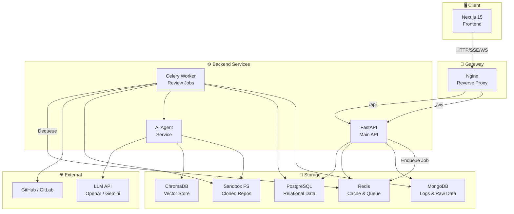
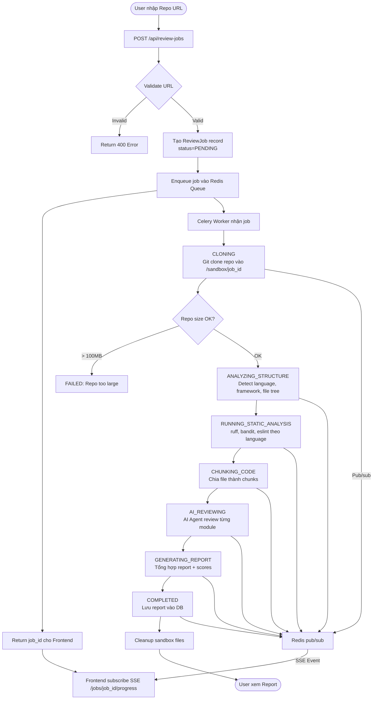
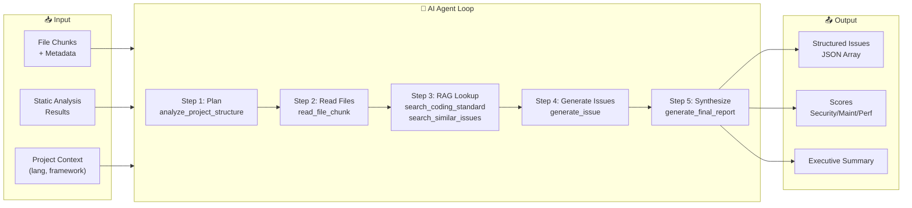
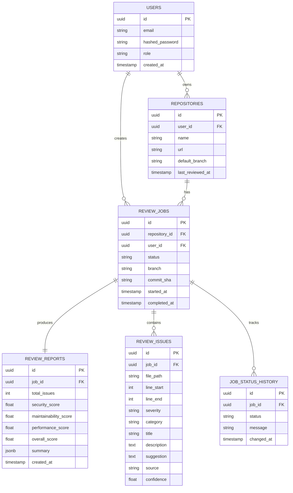

# RepoGuard AI — Tài Liệu Kế Hoạch Dự Án Cuối Khóa

> **Role:** Technical Lead + Solution Architect + Business Analyst  
> **Deadline:** 4 tuần  
> **Stack:** FastAPI · Next.js 15 · PostgreSQL · MongoDB · Redis · AI Agent · RAG · Docker

---

## 1. MỤC TIÊU DỰ ÁN

### 1.1 Vấn đề cần giải quyết

Developer thường commit code mà chưa được review kỹ — lý do chủ quan là bận, chủ quan là không có senior reviewer, hoặc đơn giản là quên. Hậu quả là bug, lỗ hổng bảo mật, code mùi leo vào production.

**RepoGuard AI** giải quyết bài toán: **tự động review source code ở cấp độ repository** — không chỉ lint từng file đơn lẻ, mà hiểu ngữ cảnh toàn project, phát hiện lỗi logic, bad practices, lỗ hổng bảo mật và đưa ra gợi ý sửa cụ thể.

### 1.2 Người dùng chính

| Nhóm | Mô tả |
|------|-------|
| Junior/Mid Developer | Muốn có feedback trước khi tạo Pull Request |
| Team Lead | Muốn enforce coding standards tự động |
| Student/Fresher | Cần check code đồ án trước khi nộp |
| Security Engineer | Muốn scan nhanh lỗ hổng bảo mật trong codebase |

### 1.3 Giá trị thực tế

- Giảm thời gian code review thủ công 40–60%
- Phát hiện sớm security issue trước khi merge
- Đưa ra báo cáo có thể đọc được — không chỉ raw output từ linter
- Hỗ trợ nhiều ngôn ngữ và framework trong một tool

### 1.4 Vì sao phù hợp lộ trình đào tạo?

| Kỹ năng trong lộ trình | Được thể hiện qua |
|------------------------|-------------------|
| FastAPI + Pydantic | Backend API toàn bộ hệ thống |
| JWT Auth + RBAC | Login, phân quyền user/admin |
| SQLAlchemy + Alembic | PostgreSQL schema cho jobs, reports |
| MongoDB + PyMongo | Lưu AI logs, file analysis raw data |
| Redis | Job queue, pub/sub realtime, token blacklist |
| Docker + Nginx | Toàn bộ hệ thống chạy Docker Compose |
| Next.js 15 + TailwindCSS | Dashboard, report viewer |
| WebSocket/SSE | Realtime job progress |
| AI Agent + Tool Calling | Core AI review pipeline |
| RAG + Vector DB | Knowledge base coding standards |
| Logging + Report | Report generation module |

---

## 2. SCOPE DỰ ÁN

### 2.1 MVP — Bắt buộc phải làm (tuần 1–3)

> Đây là những gì tạo ra giá trị core, thiếu bất kỳ cái nào thì dự án không chạy được.

| # | Tính năng | Ưu tiên |
|---|-----------|---------|
| 1 | Đăng ký / Đăng nhập với JWT + Refresh Token | P0 |
| 2 | Thêm repository URL (GitHub/GitLab public) | P0 |
| 3 | Clone repo vào sandbox, giới hạn size | P0 |
| 4 | Phân tích cấu trúc project (ngôn ngữ, framework, file tree) | P0 |
| 5 | Chạy static analyzer (ít nhất Python: ruff + bandit) | P0 |
| 6 | AI review từng file quan trọng (GPT-4o-mini hoặc Gemini Flash) | P0 |
| 7 | Tổng hợp report với score | P0 |
| 8 | Dashboard hiển thị issue list, filter theo severity | P0 |
| 9 | Realtime progress qua SSE | P0 |
| 10 | Lưu lịch sử review | P0 |

### 2.2 Advanced Features — Làm để bài nổi bật (tuần 3–4)

| # | Tính năng | Ghi chú |
|---|-----------|---------|
| 1 | RAG với OWASP + Python best practices | Chromadb local, dễ chạy |
| 2 | AI Debug Page — xem trace tool calling | Cực hay khi demo cho mentor |
| 3 | So sánh 2 lần review (diff) | PostgreSQL query đơn giản |
| 4 | Multi-language support (JS/TS + eslint) | Chỉ thêm analyzer mới |
| 5 | Issue detail với code snippet viewer | Monaco Editor hoặc Prism |
| 6 | Export report PDF hoặc Markdown | WeasyPrint hoặc markdown-pdf |
| 7 | RBAC: admin có thể xem tất cả user jobs | FastAPI dependencies |

### 2.3 Optional — Nếu còn thời gian

| # | Tính năng | Rủi ro |
|---|-----------|--------|
| 1 | Private repo với GitHub OAuth token | Phức tạp flow auth |
| 2 | Semgrep integration | Setup nặng |
| 3 | Gitleaks secret scanning | Docker-in-Docker phức tạp |
| 4 | PR comment webhook | Cần GitHub App |
| 5 | Multi-user collaboration | Out of scope 4 tuần |

> ⚠️ **Cảnh báo:** Đừng cố làm Optional. Tập trung MVP + 3–4 Advanced feature quan trọng nhất. Mentor sẽ đánh giá depth, không phải breadth.

---

## 3. KIẾN TRÚC TỔNG THỂ

### 3.1 System Architecture



### 3.2 Review Job Workflow



### 3.3 AI Review Pipeline



### 3.4 Database Relationship Overview



### 3.5 Luồng dữ liệu end-to-end

```
User nhập URL
    → POST /api/review-jobs (FastAPI)
    → Tạo record trong PostgreSQL (status=PENDING)
    → Push job_id vào Redis Queue
    → Trả job_id về Frontend

Frontend
    → GET /api/review-jobs/{job_id}/stream (SSE)
    → Subscribe Redis pub/sub channel: job:{job_id}:progress

Celery Worker
    → Pop job từ Redis Queue
    → Git clone vào /tmp/sandbox/{job_id}/
    → Publish progress events → Redis pub/sub
    → Chạy structure analyzer → kết quả lưu MongoDB (file_analysis_results)
    → Chạy static tools → kết quả lưu MongoDB (raw_static_analysis_outputs)
    → Chunk code → metadata lưu MongoDB (chunk_metadata)
    → Gọi AI Agent Service
        → AI gọi tools (read_file, search RAG, generate_issue)
        → Mỗi tool call log vào MongoDB (tool_call_logs)
        → AI trả về structured issues JSON
    → Tổng hợp report → lưu PostgreSQL (review_reports, review_issues)
    → Publish COMPLETED event → Redis pub/sub → SSE → Frontend update

Frontend
    → Fetch GET /api/review-jobs/{job_id}/report
    → Render dashboard: charts, issue table, scores
```

---

## 4. BACKEND DESIGN

### 4.1 Module Overview

| Module | Chức năng chính | DB |
|--------|----------------|-----|
| `auth` | Register, login, logout, refresh token | PostgreSQL + Redis |
| `users` | Profile, settings | PostgreSQL |
| `repositories` | CRUD repository URL | PostgreSQL |
| `review_jobs` | Tạo job, theo dõi status | PostgreSQL + Redis |
| `code_analysis` | Structure analyzer, file tree, language detect | MongoDB |
| `static_analysis` | Chạy ruff/bandit/eslint, parse output | MongoDB |
| `ai_review` | AI Agent pipeline, tool calling | MongoDB |
| `reports` | Truy vấn report, tính score | PostgreSQL |
| `notifications` | SSE stream, pub/sub bridge | Redis |
| `websocket` | Alternative realtime (nếu cần bidirectional) | Redis |
| `admin` | Xem tất cả jobs, logs, system health | PostgreSQL + MongoDB |

### 4.2 Module: `auth`

**Endpoints:**

```
POST /api/auth/register
POST /api/auth/login
POST /api/auth/refresh
POST /api/auth/logout
GET  /api/auth/me
```

**Request/Response mẫu:**

```json
// POST /api/auth/login
// Request:
{
  "email": "dev@example.com",
  "password": "Secure@123"
}

// Response 200:
{
  "access_token": "eyJ...",
  "refresh_token": "eyJ...",
  "token_type": "Bearer",
  "user": {
    "id": "uuid-...",
    "email": "dev@example.com",
    "role": "user"
  }
}
```

**Services:** `AuthService` (register, verify password, issue tokens), `TokenService` (create/verify JWT, blacklist via Redis)

### 4.3 Module: `review_jobs`

**Endpoints:**

```
POST   /api/review-jobs                    # Tạo job mới
GET    /api/review-jobs                    # Danh sách job của user
GET    /api/review-jobs/{job_id}           # Chi tiết job
DELETE /api/review-jobs/{job_id}           # Hủy job
GET    /api/review-jobs/{job_id}/stream    # SSE progress stream
GET    /api/review-jobs/{job_id}/report    # Report của job
GET    /api/review-jobs/{job_id}/issues    # Issue list với filter/pagination
```

**Request tạo job:**

```json
// POST /api/review-jobs
{
  "repository_id": "uuid-...",
  "branch": "main",
  "options": {
    "run_static_analysis": true,
    "ai_review_depth": "standard",
    "languages": ["python", "javascript"]
  }
}

// Response 201:
{
  "job_id": "uuid-...",
  "status": "PENDING",
  "created_at": "2025-01-15T10:00:00Z",
  "stream_url": "/api/review-jobs/uuid-.../stream"
}
```

**Services:** `ReviewJobService` (create, get, cancel), `JobQueueService` (enqueue/dequeue via Redis)

### 4.4 Module: `reports`

**Endpoints:**

```
GET /api/reports/{job_id}                  # Full report
GET /api/reports/{job_id}/summary          # Executive summary only
GET /api/reports/{job_id}/issues           # Issues với filter, pagination, sort
GET /api/reports/{job_id}/issues/{id}      # Chi tiết 1 issue
GET /api/reports/compare?job_a=X&job_b=Y   # So sánh 2 lần review
GET /api/reports/{job_id}/export?format=pdf # Export
```

**Response issue list:**

```json
{
  "total": 47,
  "page": 1,
  "per_page": 20,
  "filters": { "severity": ["high", "critical"], "category": "security" },
  "issues": [
    {
      "id": "uuid-...",
      "file_path": "app/auth/utils.py",
      "line_start": 42,
      "line_end": 48,
      "severity": "critical",
      "category": "security",
      "title": "SQL Injection Risk",
      "description": "Raw string interpolation in SQL query without parameterization",
      "suggestion": "Use parameterized queries via SQLAlchemy: session.execute(text('...'), {'param': value})",
      "source": "ai_review",
      "confidence": 0.92
    }
  ]
}
```

### 4.5 Module: `notifications` (SSE)

```python
# FastAPI SSE endpoint
@router.get("/review-jobs/{job_id}/stream")
async def job_progress_stream(
    job_id: str,
    current_user: User = Depends(get_current_user)
):
    async def event_generator():
        pubsub = redis_client.pubsub()
        channel = f"job:{job_id}:progress"
        await pubsub.subscribe(channel)
        
        async for message in pubsub.listen():
            if message["type"] == "message":
                data = json.loads(message["data"])
                yield {
                    "event": data["event"],
                    "data": json.dumps(data)
                }
                if data["status"] in ["COMPLETED", "FAILED"]:
                    break
    
    return EventSourceResponse(event_generator())
```

---

## 5. DATABASE DESIGN

### 5.1 PostgreSQL Schema

#### Bảng `users`
```sql
CREATE TABLE users (
    id          UUID PRIMARY KEY DEFAULT gen_random_uuid(),
    email       VARCHAR(255) UNIQUE NOT NULL,
    hashed_pw   VARCHAR(255) NOT NULL,
    full_name   VARCHAR(255),
    role        VARCHAR(50) NOT NULL DEFAULT 'user', -- 'user' | 'admin'
    is_active   BOOLEAN DEFAULT TRUE,
    created_at  TIMESTAMP WITH TIME ZONE DEFAULT NOW(),
    updated_at  TIMESTAMP WITH TIME ZONE DEFAULT NOW()
);
```

#### Bảng `repositories`
```sql
CREATE TABLE repositories (
    id              UUID PRIMARY KEY DEFAULT gen_random_uuid(),
    user_id         UUID REFERENCES users(id) ON DELETE CASCADE,
    name            VARCHAR(255) NOT NULL,
    url             TEXT NOT NULL,
    platform        VARCHAR(50),  -- 'github' | 'gitlab' | 'other'
    default_branch  VARCHAR(100) DEFAULT 'main',
    description     TEXT,
    last_reviewed_at TIMESTAMP WITH TIME ZONE,
    created_at      TIMESTAMP WITH TIME ZONE DEFAULT NOW()
);
```

#### Bảng `review_jobs`
```sql
CREATE TABLE review_jobs (
    id              UUID PRIMARY KEY DEFAULT gen_random_uuid(),
    repository_id   UUID REFERENCES repositories(id) ON DELETE CASCADE,
    user_id         UUID REFERENCES users(id) ON DELETE CASCADE,
    status          VARCHAR(50) NOT NULL DEFAULT 'PENDING',
    -- PENDING | CLONING | ANALYZING_STRUCTURE | RUNNING_STATIC_ANALYSIS
    -- CHUNKING_CODE | AI_REVIEWING | GENERATING_REPORT | COMPLETED | FAILED
    branch          VARCHAR(100),
    commit_sha      VARCHAR(40),
    error_message   TEXT,
    sandbox_path    TEXT,  -- /tmp/sandbox/{job_id} — xóa sau khi xong
    options         JSONB,
    started_at      TIMESTAMP WITH TIME ZONE,
    completed_at    TIMESTAMP WITH TIME ZONE,
    created_at      TIMESTAMP WITH TIME ZONE DEFAULT NOW()
);
CREATE INDEX idx_review_jobs_user ON review_jobs(user_id);
CREATE INDEX idx_review_jobs_status ON review_jobs(status);
```

#### Bảng `review_reports`
```sql
CREATE TABLE review_reports (
    id                      UUID PRIMARY KEY DEFAULT gen_random_uuid(),
    job_id                  UUID UNIQUE REFERENCES review_jobs(id) ON DELETE CASCADE,
    total_files_analyzed    INT DEFAULT 0,
    total_issues            INT DEFAULT 0,
    critical_count          INT DEFAULT 0,
    high_count              INT DEFAULT 0,
    medium_count            INT DEFAULT 0,
    low_count               INT DEFAULT 0,
    info_count              INT DEFAULT 0,
    security_score          FLOAT,   -- 0.0 - 10.0
    maintainability_score   FLOAT,
    performance_score       FLOAT,
    overall_score           FLOAT,
    tech_stack              JSONB,   -- {"languages": ["python"], "frameworks": ["fastapi"]}
    top_risky_files         JSONB,   -- [{"path": "...", "issue_count": 5}]
    executive_summary       TEXT,
    ai_model_used           VARCHAR(100),
    created_at              TIMESTAMP WITH TIME ZONE DEFAULT NOW()
);
```

#### Bảng `review_issues`
```sql
CREATE TABLE review_issues (
    id              UUID PRIMARY KEY DEFAULT gen_random_uuid(),
    job_id          UUID REFERENCES review_jobs(id) ON DELETE CASCADE,
    file_path       TEXT NOT NULL,
    line_start      INT,
    line_end        INT,
    severity        VARCHAR(20) NOT NULL, -- critical | high | medium | low | info
    category        VARCHAR(50) NOT NULL, -- security | performance | maintainability | style | bug
    title           VARCHAR(255) NOT NULL,
    description     TEXT NOT NULL,
    suggestion      TEXT,
    source          VARCHAR(30) NOT NULL, -- 'ai_review' | 'ruff' | 'bandit' | 'eslint'
    confidence      FLOAT,
    raw_output      JSONB,  -- raw output từ tool nếu có
    created_at      TIMESTAMP WITH TIME ZONE DEFAULT NOW()
);
CREATE INDEX idx_issues_job ON review_issues(job_id);
CREATE INDEX idx_issues_severity ON review_issues(severity);
CREATE INDEX idx_issues_category ON review_issues(category);
CREATE INDEX idx_issues_file ON review_issues(file_path);
```

#### Bảng `job_status_history`
```sql
CREATE TABLE job_status_history (
    id          UUID PRIMARY KEY DEFAULT gen_random_uuid(),
    job_id      UUID REFERENCES review_jobs(id) ON DELETE CASCADE,
    status      VARCHAR(50) NOT NULL,
    message     TEXT,
    progress    INT DEFAULT 0,  -- 0-100
    changed_at  TIMESTAMP WITH TIME ZONE DEFAULT NOW()
);
```

### 5.2 MongoDB Collections

#### Collection: `file_analysis_results`
```json
{
  "_id": "ObjectId",
  "job_id": "uuid-...",
  "analyzed_at": "ISODate",
  "project_structure": {
    "total_files": 85,
    "total_lines": 12400,
    "languages": {
      "python": { "file_count": 42, "line_count": 8200 },
      "javascript": { "file_count": 20, "line_count": 3100 }
    },
    "frameworks": ["fastapi", "sqlalchemy", "react"],
    "entry_points": ["main.py", "app/__init__.py"],
    "ignored_paths": ["venv/", "node_modules/", "__pycache__/", ".git/"]
  },
  "file_tree": [
    {
      "path": "app/auth/router.py",
      "language": "python",
      "size_bytes": 2048,
      "line_count": 87,
      "should_review": true,
      "ignore_reason": null
    }
  ]
}
```

#### Collection: `raw_static_analysis_outputs`
```json
{
  "_id": "ObjectId",
  "job_id": "uuid-...",
  "tool": "ruff",
  "language": "python",
  "ran_at": "ISODate",
  "exit_code": 0,
  "stdout": "app/auth/utils.py:42:5: E501 Line too long (120 > 88 characters)...",
  "parsed_issues": [
    {
      "file_path": "app/auth/utils.py",
      "line_start": 42,
      "col": 5,
      "rule_id": "E501",
      "message": "Line too long",
      "severity": "low",
      "category": "style"
    }
  ]
}
```

#### Collection: `tool_call_logs` (AI Agent traces)
```json
{
  "_id": "ObjectId",
  "job_id": "uuid-...",
  "session_id": "uuid-...",
  "sequence": 3,
  "tool_name": "search_coding_standard",
  "called_at": "ISODate",
  "duration_ms": 245,
  "input": {
    "query": "SQL injection prevention Python SQLAlchemy",
    "top_k": 3
  },
  "output": {
    "retrieved_chunks": [
      {
        "source": "OWASP Top 10 - A03:2021",
        "content": "Never concatenate user input directly into SQL...",
        "similarity_score": 0.89
      }
    ]
  }
}
```

#### Collection: `chunk_metadata`
```json
{
  "_id": "ObjectId",
  "job_id": "uuid-...",
  "file_path": "app/auth/utils.py",
  "chunk_index": 0,
  "total_chunks": 3,
  "line_start": 1,
  "line_end": 50,
  "token_count": 380,
  "language": "python",
  "has_functions": ["hash_password", "verify_password"],
  "has_classes": [],
  "chunk_text": "import bcrypt\nimport secrets\n..."
}
```

### 5.3 Redis Keys

| Key Pattern | Type | TTL | Mục đích |
|-------------|------|-----|---------|
| `session:{user_id}` | String | 7 days | Session data |
| `blacklist:token:{jti}` | String | = token TTL | Invalidated access tokens |
| `job:{job_id}:status` | String | 24h | Current job status (cache) |
| `job:{job_id}:progress` | Pub/Sub channel | — | SSE realtime events |
| `cache:repo:{repo_id}:stats` | JSON String | 5min | Repository stats cache |
| `queue:review_jobs` | List | — | Celery task queue |
| `rate_limit:user:{user_id}` | Counter | 1h | API rate limiting |

---

## 6. AI PIPELINE

### 6.1 Tổng quan

AI Agent sử dụng mô hình **ReAct pattern** (Reasoning + Acting): agent lên kế hoạch, gọi tools để thu thập thông tin, sau đó sinh issue.

```
Input: project_context + file_chunks + static_analysis_results
Output: List[ReviewIssue] + ReportSummary + Scores
```

### 6.2 Code Chunking Strategy

```python
class CodeChunker:
    """
    Ưu tiên chunk theo ranh giới ngữ nghĩa:
    1. Class boundary
    2. Function boundary  
    3. Nếu function quá dài: chunk theo block (if/for/with)
    4. Fallback: fixed 60 lines với 10 lines overlap
    """
    MAX_TOKENS_PER_CHUNK = 1500  # ~400-500 dòng code
    OVERLAP_LINES = 10
    
    def chunk_python_file(self, file_path: str, content: str) -> List[Chunk]:
        import ast
        tree = ast.parse(content)
        chunks = []
        for node in ast.walk(tree):
            if isinstance(node, (ast.ClassDef, ast.FunctionDef)):
                chunk_text = ast.get_source_segment(content, node)
                chunks.append(Chunk(
                    file_path=file_path,
                    line_start=node.lineno,
                    line_end=node.end_lineno,
                    content=chunk_text,
                    chunk_type="function" if isinstance(node, ast.FunctionDef) else "class"
                ))
        return chunks
```

### 6.3 AI Tools (Tool Calling Schema)

#### Tool 1: `analyze_project_structure`
```json
{
  "name": "analyze_project_structure",
  "description": "Get the project structure overview including languages, frameworks, and file list to review",
  "input_schema": {
    "type": "object",
    "properties": {
      "job_id": { "type": "string" }
    },
    "required": ["job_id"]
  },
  "output_example": {
    "languages": ["python", "javascript"],
    "frameworks": ["fastapi", "react"],
    "total_files": 85,
    "files_to_review": [
      { "path": "app/auth/utils.py", "priority": "high", "reason": "auth-related" }
    ],
    "static_analysis_summary": {
      "ruff": { "issue_count": 23 },
      "bandit": { "issue_count": 3, "high_severity": 1 }
    }
  }
}
```

#### Tool 2: `read_file_chunk`
```json
{
  "name": "read_file_chunk",
  "description": "Read a specific chunk of a file for detailed review",
  "input_schema": {
    "type": "object",
    "properties": {
      "job_id": { "type": "string" },
      "file_path": { "type": "string" },
      "chunk_index": { "type": "integer" }
    },
    "required": ["job_id", "file_path", "chunk_index"]
  },
  "output_example": {
    "file_path": "app/auth/utils.py",
    "chunk_index": 0,
    "total_chunks": 3,
    "line_start": 1,
    "line_end": 48,
    "content": "import bcrypt\n...",
    "language": "python",
    "static_issues_in_range": [
      { "line": 42, "tool": "ruff", "message": "Line too long" }
    ]
  }
}
```

#### Tool 3: `search_coding_standard`
```json
{
  "name": "search_coding_standard",
  "description": "Search the knowledge base for relevant coding standards, best practices, or security guidelines",
  "input_schema": {
    "type": "object",
    "properties": {
      "query": { "type": "string" },
      "language": { "type": "string" },
      "top_k": { "type": "integer", "default": 3 }
    },
    "required": ["query"]
  },
  "output_example": {
    "results": [
      {
        "source": "OWASP Top 10 - A03:2021 Injection",
        "content": "Use parameterized queries or prepared statements...",
        "similarity_score": 0.91
      }
    ]
  }
}
```

#### Tool 4: `generate_issue`
```json
{
  "name": "generate_issue",
  "description": "Generate a structured issue found during review",
  "input_schema": {
    "type": "object",
    "properties": {
      "file_path": { "type": "string" },
      "line_start": { "type": "integer" },
      "line_end": { "type": "integer" },
      "severity": { "type": "string", "enum": ["critical", "high", "medium", "low", "info"] },
      "category": { "type": "string", "enum": ["security", "bug", "performance", "maintainability", "style"] },
      "title": { "type": "string" },
      "description": { "type": "string" },
      "suggestion": { "type": "string" },
      "confidence": { "type": "number", "minimum": 0, "maximum": 1 },
      "references": { "type": "array", "items": { "type": "string" } }
    },
    "required": ["file_path", "severity", "category", "title", "description", "confidence"]
  }
}
```

#### Tool 5: `generate_final_report`
```json
{
  "name": "generate_final_report",
  "description": "Synthesize all issues into final report scores and executive summary",
  "input_schema": {
    "type": "object",
    "properties": {
      "job_id": { "type": "string" },
      "all_issues": { "type": "array" }
    }
  },
  "output_example": {
    "security_score": 6.5,
    "maintainability_score": 7.2,
    "performance_score": 8.0,
    "overall_score": 7.1,
    "executive_summary": "Project has solid structure but 2 critical SQL injection risks in auth module...",
    "top_priorities": [
      "Fix SQL injection in app/auth/utils.py:42",
      "Remove hardcoded secret key in config.py:15"
    ]
  }
}
```

### 6.4 System Prompt cho AI Agent

```python
REVIEW_SYSTEM_PROMPT = """
You are an expert code reviewer with deep knowledge of security, performance, and software architecture.

## Your task:
Review the provided repository and identify genuine issues. Focus on:
1. Security vulnerabilities (SQL injection, XSS, insecure deserialization, hardcoded secrets)
2. Critical bugs that could cause runtime errors
3. Performance issues (N+1 queries, unbounded loops, memory leaks)
4. Maintainability problems (dead code, overly complex functions, missing error handling)
5. Style issues (only if clearly violating the language's conventions)

## IMPORTANT RULES:
- Use `search_coding_standard` tool BEFORE flagging any security issue
- Only generate issues where confidence >= 0.7
- Never flag issues you are not sure about — false positives waste developer time
- For each issue, cite the specific line numbers
- Prioritize: security > critical bugs > performance > maintainability > style
- Do NOT suggest refactoring everything — focus on genuine problems

## Output format:
Always use `generate_issue` tool for each issue. Never output issues as free text.
After reviewing all files, call `generate_final_report` to synthesize.
"""
```

### 6.5 Giảm Hallucination

| Kỹ thuật | Cách làm |
|----------|----------|
| Grounding bằng RAG | Trước khi flag security issue, bắt AI search OWASP |
| Confidence threshold | Chỉ lưu issue có `confidence >= 0.7` |
| Structured output via tools | AI không được tự ý sinh text — phải dùng `generate_issue` tool |
| Cross-validate với static tools | Nếu AI flag issue nhưng static tool không có → giảm severity |
| Line number validation | Backend validate line_start/line_end có tồn tại trong file |

---

## 7. RAG DESIGN

### 7.1 Knowledge Base Sources

| Nguồn | Định dạng | Cách ingest |
|-------|-----------|-------------|
| OWASP Top 10 2021 | Markdown | Crawl/download |
| Python Best Practices (PEP 8, PEP 20) | Text | Download từ python.org |
| FastAPI Best Practices | Markdown | Crawl tiangolo.com/docs |
| Clean Code Principles | Text | Manual curation |
| Security Checklist | Markdown | Manual curation |
| Repo's own README/CONTRIBUTING | Text | Clone-time extraction |

### 7.2 Ingestion Pipeline

```python
class RAGIngestionPipeline:
    def __init__(self, chroma_client, embedding_model):
        self.chroma = chroma_client
        self.embedder = embedding_model  # sentence-transformers/all-MiniLM-L6-v2
    
    def ingest_document(self, doc_path: str, source_name: str, language: str = None):
        # 1. Load document
        content = self.load_file(doc_path)
        
        # 2. Split thành chunks (512 tokens, 50 token overlap)
        chunks = self.text_splitter.split_text(content)
        
        # 3. Tạo metadata cho mỗi chunk
        documents = []
        for i, chunk in enumerate(chunks):
            documents.append({
                "text": chunk,
                "metadata": {
                    "source": source_name,
                    "chunk_index": i,
                    "language": language,
                    "doc_type": "standard",  # standard | guideline | checklist
                    "ingested_at": datetime.utcnow().isoformat()
                }
            })
        
        # 4. Embed và lưu vào ChromaDB
        self.chroma.collection.add(
            documents=[d["text"] for d in documents],
            metadatas=[d["metadata"] for d in documents],
            ids=[f"{source_name}_{i}" for i in range(len(documents))]
        )
```

### 7.3 Vector DB

**Chọn ChromaDB** — lý do:
- Chạy local, không cần cloud
- Python native, tích hợp dễ
- Persistent mode: lưu file disk
- Hỗ trợ metadata filtering

```python
# Setup ChromaDB
import chromadb
client = chromadb.PersistentClient(path="/data/chromadb")
collection = client.get_or_create_collection(
    name="coding_standards",
    metadata={"hnsw:space": "cosine"}
)

# Embedding model: free, chạy local
from sentence_transformers import SentenceTransformer
model = SentenceTransformer("all-MiniLM-L6-v2")
```

### 7.4 Khi nào AI cần retrieve

```
Trigger 1: Khi AI phát hiện potential security issue
  → search_coding_standard(query=issue_description, language=lang)
  → Dùng retrieved context để validate và strengthen gợi ý

Trigger 2: Khi AI review file liên quan đến auth/crypto
  → Tự động retrieve OWASP guidelines

Trigger 3: Khi AI gặp pattern không chắc chắn
  → search_similar_issues(pattern=code_pattern)
```

### 7.5 RAG Debug Page trên Frontend

Page `/ai-debug` hiển thị:
- Danh sách tool calls theo thứ tự thực hiện
- Với mỗi `search_coding_standard` call:
  - Query input
  - Top-3 retrieved chunks với similarity score
  - Source document name
- Với mỗi `generate_issue` call:
  - Structured input
  - Final issue được lưu
- Timeline tổng thể của agent session

---

## 8. STATIC ANALYSIS

### 8.1 Tool Selection

| Ngôn ngữ | Tool | Mục đích | Cách chạy |
|----------|------|----------|-----------|
| Python | `ruff` | Linting, style, basic bug | `ruff check --output-format=json` |
| Python | `bandit` | Security scan | `bandit -r . -f json` |
| JavaScript/TypeScript | `eslint` | Linting + rules | `eslint --format json` |
| All | `semgrep` | Pattern-based security | `semgrep --json --config=auto` (optional) |

> ⚠️ **Không dùng pylint** — chậm, output phức tạp. Ruff bao phủ 95% use case pylint, nhanh hơn 100x.

> ⚠️ **Semgrep optional** — nặng để setup, để Advanced nếu kịp.

### 8.2 Cách chạy an toàn

```python
import subprocess
import shutil

class StaticAnalyzer:
    TIMEOUT_SECONDS = 60
    
    def run_tool(self, tool: str, target_path: str) -> dict:
        commands = {
            "ruff": ["ruff", "check", target_path, "--output-format=json", "--no-cache"],
            "bandit": ["bandit", "-r", target_path, "-f", "json", "-q"],
            "eslint": ["npx", "eslint", target_path, "--format=json", "--no-eslintrc",
                       "--rule", '{"no-eval": "error", "no-unused-vars": "warn"}']
        }
        
        cmd = commands.get(tool)
        if not cmd:
            raise ValueError(f"Unknown tool: {tool}")
        
        result = subprocess.run(
            cmd,
            capture_output=True,
            text=True,
            timeout=self.TIMEOUT_SECONDS,
            cwd=target_path
        )
        
        return {
            "tool": tool,
            "exit_code": result.returncode,
            "stdout": result.stdout,
            "stderr": result.stderr
        }
```

### 8.3 Normalized Issue Format

Tất cả tools đều parse về format chung:

```python
class NormalizedIssue(BaseModel):
    file_path: str
    line_start: Optional[int]
    line_end: Optional[int]
    severity: Literal["critical", "high", "medium", "low", "info"]
    category: Literal["security", "bug", "performance", "maintainability", "style"]
    title: str
    description: str
    suggestion: Optional[str]
    source: str           # 'ruff' | 'bandit' | 'eslint' | 'ai_review'
    rule_id: Optional[str]  # E501, B105, etc.
    confidence: float = 1.0  # Static tools = 1.0, AI = 0.7-1.0
    raw_output: Optional[dict]
```

### 8.4 Parser cho từng tool

```python
class BanditParser:
    SEVERITY_MAP = {"HIGH": "critical", "MEDIUM": "high", "LOW": "medium"}
    
    def parse(self, raw_json: str) -> List[NormalizedIssue]:
        data = json.loads(raw_json)
        issues = []
        for result in data.get("results", []):
            issues.append(NormalizedIssue(
                file_path=result["filename"],
                line_start=result["line_number"],
                severity=self.SEVERITY_MAP.get(result["issue_severity"], "low"),
                category="security",
                title=result["test_name"],
                description=result["issue_text"],
                suggestion=f"See: {result.get('more_info', '')}",
                source="bandit",
                rule_id=result["test_id"],
                confidence=float(result["issue_confidence"].lower().replace("high", "0.9")
                                  .replace("medium", "0.7").replace("low", "0.5"))
            ))
        return issues
```

### 8.5 Kết hợp Static Analysis + AI

```
Flow:
1. Chạy static tools → lưu MongoDB raw_static_analysis_outputs
2. Parse → NormalizedIssue list
3. Trước khi gọi AI, inject static issues vào context:
   "These issues were already detected by static tools: [...]"
4. AI được yêu cầu:
   a. Validate static issues (giữ/bỏ/nâng severity nếu thấy cần)
   b. Tìm thêm issues mà static tools không thể detect (logic bugs, architecture)
5. Merge: deduplicate theo (file_path, line_start, rule_id)
6. Source field ghi rõ 'bandit' vs 'ai_review' để user biết nguồn
```

---

## 9. SECURITY & SANDBOX

### 9.1 Giới hạn khi clone

```python
SANDBOX_LIMITS = {
    "max_repo_size_mb": 100,
    "max_files": 500,
    "max_file_size_kb": 500,
    "clone_timeout_seconds": 60,
    "job_ttl_seconds": 3600,      # Xóa sandbox sau 1h
    "max_concurrent_jobs": 5,     # Per user
}

IGNORED_PATHS = [
    "node_modules/", "venv/", ".venv/", "__pycache__/",
    "dist/", "build/", ".git/", ".next/", "*.lock",
    "*.min.js", "*.min.css", "*.map"
]

IGNORED_EXTENSIONS = [
    ".png", ".jpg", ".jpeg", ".gif", ".ico", ".svg",
    ".pdf", ".zip", ".tar", ".gz", ".exe", ".dll",
    ".pyc", ".pyo", ".class"
]
```

### 9.2 Clone an toàn

```python
async def safe_clone(repo_url: str, job_id: str) -> str:
    # 1. Validate URL format (chỉ github.com, gitlab.com)
    if not is_allowed_host(repo_url):
        raise SecurityError("Only GitHub and GitLab are supported")
    
    sandbox_path = f"/tmp/sandbox/{job_id}"
    os.makedirs(sandbox_path, exist_ok=True)
    
    # 2. Clone với giới hạn depth và size
    result = subprocess.run([
        "git", "clone",
        "--depth", "1",           # Shallow clone
        "--single-branch",
        "--filter=blob:limit=500k",  # Bỏ file > 500KB
        repo_url,
        sandbox_path
    ], timeout=60, capture_output=True)
    
    # 3. Kiểm tra tổng size
    total_size = get_dir_size(sandbox_path)
    if total_size > SANDBOX_LIMITS["max_repo_size_mb"] * 1024 * 1024:
        shutil.rmtree(sandbox_path)
        raise SecurityError("Repository exceeds size limit")
    
    # 4. Schedule cleanup
    schedule_cleanup(sandbox_path, ttl=3600)
    
    return sandbox_path
```

### 9.3 Không execute code

```
Tuyệt đối không:
- Import và chạy Python code từ repo
- Chạy npm start, python main.py, etc.
- Eval bất kỳ code nào từ repo

Chỉ:
- Đọc file text
- Parse AST (không execute)
- Chạy static analyzer với cờ read-only
```

### 9.4 Secret Detection (đơn giản)

```python
SECRET_PATTERNS = [
    r'(?i)(api_key|secret_key|password|token)\s*=\s*["\'][^"\']+["\']',
    r'(?i)aws_access_key_id\s*=\s*["\'][A-Z0-9]{20}["\']',
    r'-----BEGIN (RSA |EC )?PRIVATE KEY-----',
]

def scan_for_secrets(file_content: str) -> List[dict]:
    """Phát hiện secret nhưng KHÔNG lưu giá trị — chỉ lưu vị trí và pattern"""
    findings = []
    for line_no, line in enumerate(file_content.splitlines(), 1):
        for pattern in SECRET_PATTERNS:
            if re.search(pattern, line):
                findings.append({
                    "line": line_no,
                    "pattern": pattern,
                    "message": "Potential hardcoded secret detected"
                    # KHÔNG lưu line content!
                })
    return findings
```

### 9.5 Private Repo (nếu cần)

```
- User cung cấp Personal Access Token (PAT)
- Lưu PAT được mã hóa bằng Fernet (Python cryptography lib)
- PAT chỉ dùng lúc clone, không log
- Sau clone xong, xóa khỏi memory
- KHÔNG lưu PAT vào DB hay log
```

---

## 10. FRONTEND DESIGN

### 10.1 Page Map

| Route | Mục đích | API calls |
|-------|----------|-----------|
| `/login` | Auth form | POST /auth/login |
| `/register` | Đăng ký | POST /auth/register |
| `/dashboard` | Tổng quan: recent jobs, stats | GET /review-jobs, GET /reports/summary |
| `/repositories` | List + thêm repo | GET/POST /repositories |
| `/repositories/[id]` | Chi tiết repo + history | GET /repositories/:id, GET /review-jobs?repo_id |
| `/reviews` | Tất cả review jobs | GET /review-jobs |
| `/reviews/[id]` | Chi tiết job + progress | GET /review-jobs/:id, SSE stream |
| `/reviews/[id]/report` | Report dashboard chính | GET /reports/:job_id |
| `/reviews/[id]/issues` | Issue table với filter | GET /reports/:job_id/issues |
| `/ai-debug` | Tool call traces, RAG results | GET /admin/jobs/:id/traces |
| `/settings` | Profile, đổi password | GET/PUT /users/me |

### 10.2 Component Tree

```
app/
├── (auth)/
│   ├── login/page.tsx
│   └── register/page.tsx
├── (dashboard)/
│   ├── layout.tsx          ← Sidebar + Navbar
│   ├── dashboard/page.tsx
│   ├── repositories/
│   │   ├── page.tsx        ← RepoList + AddRepoForm
│   │   └── [id]/page.tsx
│   ├── reviews/
│   │   ├── page.tsx        ← JobList
│   │   └── [id]/
│   │       ├── page.tsx    ← JobProgress (SSE)
│   │       ├── report/page.tsx  ← ReportDashboard
│   │       └── issues/page.tsx  ← IssueTable
│   └── ai-debug/page.tsx

components/
├── ui/           ← shadcn/ui components
├── charts/
│   ├── IssueBySeverityChart.tsx  ← Recharts Pie
│   ├── IssuesByCategoryChart.tsx ← Recharts Bar
│   └── ScoreGauge.tsx            ← Recharts RadialBar
├── review/
│   ├── JobProgress.tsx           ← SSE consumer + progress steps
│   ├── RepoUrlForm.tsx
│   ├── IssueTable.tsx            ← Table + filter + pagination
│   ├── IssueDetailDrawer.tsx     ← Drawer với code snippet
│   └── CodeSnippetViewer.tsx     ← Prism.js syntax highlight
└── debug/
    ├── ToolCallTimeline.tsx
    └── RAGChunkViewer.tsx
```

### 10.3 State Management

```typescript
// Zustand stores
stores/
├── authStore.ts      // user, tokens, login/logout
├── jobStore.ts       // current job, status, progress
└── filterStore.ts    // issue filters: severity, category, search

// SSE Hook
hooks/useJobProgress.ts:
  - Connect SSE khi vào /reviews/[id]
  - Parse events → update jobStore
  - Disconnect khi COMPLETED/FAILED
```

### 10.4 Realtime Progress UI

```
[Step 1: CLONING]        ●━━━━━━━━━━  (10%)  ✓ Done
[Step 2: ANALYZING]      ●━━━━━━━━━━  (25%)  ⏳ Running...
[Step 3: STATIC ANALYSIS] ○           (40%)  ⏺ Pending
[Step 4: AI REVIEWING]   ○           (70%)  ⏺ Pending  
[Step 5: REPORT]         ○           (100%) ⏺ Pending
```

### 10.5 Report Dashboard Layout

```
┌────────────────────────────────────────────────────┐
│  Overall Score: 7.1/10    🔴 Critical: 2           │
│  Security: 6.5  Maint: 7.2  Perf: 8.0             │
├──────────────┬─────────────────────────────────────┤
│ Issues by    │ Issues by Category                  │
│ Severity     │ [Bar chart]                         │
│ [Pie chart]  │                                     │
├──────────────┴─────────────────────────────────────┤
│ Top Risky Files                                    │
│ app/auth/utils.py ████████████████ 8 issues        │
│ app/db/session.py ████████ 4 issues                │
├────────────────────────────────────────────────────┤
│ Executive Summary (AI generated)                   │
│ "Project shows solid architecture but has 2        │
│ critical SQL injection risks..."                   │
└────────────────────────────────────────────────────┘
```

---

## 11. REALTIME DESIGN

### 11.1 SSE vs WebSocket

| Tiêu chí | SSE | WebSocket |
|----------|-----|-----------|
| Direction | Server → Client only | Bidirectional |
| Protocol | HTTP/1.1 | WS |
| Auto-reconnect | Built-in | Manual |
| Load balancer friendly | Có (stateless) | Khó hơn |
| Use case phù hợp | Job progress, notifications | Chat, collaborative edit |

**Quyết định: Dùng SSE** cho review progress. Lý do:
- Client chỉ cần nhận (không cần gửi ngược)
- HTTP native, qua Nginx dễ hơn
- Không cần maintain WS connection pool

**Dùng WebSocket** cho: không cần trong scope này — để Optional nếu muốn thêm real-time comment vào issues.

### 11.2 Redis Pub/Sub Bridge

```
Worker → publish → Redis channel "job:{id}:progress"
                         ↓
FastAPI SSE endpoint → subscribe → redis pubsub
                         ↓
                    EventSourceResponse → Client
```

### 11.3 Event Message Format

```typescript
// TypeScript interface cho SSE events
interface ProgressEvent {
  job_id: string;
  event: "status_change" | "progress_update" | "log" | "completed" | "failed";
  status: JobStatus;
  progress: number;      // 0-100
  message: string;
  timestamp: string;     // ISO 8601
  data?: {
    files_found?: number;
    issues_found?: number;
    current_file?: string;
    error_detail?: string;
  };
}

// Ví dụ events:
// {"event":"status_change","status":"CLONING","progress":10,"message":"Cloning repository..."}
// {"event":"progress_update","status":"AI_REVIEWING","progress":65,"message":"Reviewing app/auth/utils.py","data":{"current_file":"app/auth/utils.py"}}
// {"event":"completed","status":"COMPLETED","progress":100,"message":"Review complete","data":{"issues_found":23}}
```

### 11.4 Job Status Flow

```
PENDING → CLONING (10%)
       → ANALYZING_STRUCTURE (25%)
       → RUNNING_STATIC_ANALYSIS (40%)
       → CHUNKING_CODE (50%)
       → AI_REVIEWING (50% → 85%, incremental)
       → GENERATING_REPORT (90%)
       → COMPLETED (100%)

FAILED có thể xảy ra ở bất kỳ bước nào
```

---

## 12. REPORT OUTPUT

### 12.1 JSON Report Structure

```json
{
  "report_id": "uuid-...",
  "job_id": "uuid-...",
  "generated_at": "2025-01-15T14:30:00Z",
  "repository": {
    "name": "my-fastapi-app",
    "url": "https://github.com/user/my-fastapi-app",
    "branch": "main",
    "commit_sha": "a1b2c3d4"
  },
  "tech_stack": {
    "languages": ["python", "javascript"],
    "frameworks": ["fastapi", "sqlalchemy", "react"],
    "package_manager": ["pip", "npm"]
  },
  "overview": {
    "total_files_analyzed": 42,
    "total_lines_analyzed": 8200,
    "total_issues": 23,
    "issues_by_severity": {
      "critical": 2,
      "high": 5,
      "medium": 9,
      "low": 6,
      "info": 1
    },
    "issues_by_category": {
      "security": 7,
      "bug": 4,
      "performance": 3,
      "maintainability": 8,
      "style": 1
    }
  },
  "scores": {
    "security": 6.5,
    "maintainability": 7.2,
    "performance": 8.0,
    "overall": 7.1
  },
  "top_risky_files": [
    { "path": "app/auth/utils.py", "issue_count": 8, "max_severity": "critical" },
    { "path": "app/db/session.py", "issue_count": 4, "max_severity": "high" }
  ],
  "executive_summary": "The project demonstrates a reasonable FastAPI architecture but has 2 critical SQL injection vulnerabilities in the authentication module that must be addressed before deployment. Security score is below acceptable threshold (6.5/10). The codebase shows good separation of concerns but inconsistent error handling across 12 endpoints.",
  "suggested_fix_priority": [
    "1. [CRITICAL] Fix SQL injection in app/auth/utils.py:42-48",
    "2. [CRITICAL] Remove hardcoded secret key in config.py:15",
    "3. [HIGH] Add input validation in app/api/users.py",
    "4. [HIGH] Fix N+1 query in app/services/report_service.py:88"
  ],
  "issues": [
    {
      "id": "uuid-...",
      "file_path": "app/auth/utils.py",
      "line_start": 42,
      "line_end": 48,
      "severity": "critical",
      "category": "security",
      "title": "SQL Injection via String Formatting",
      "description": "User input is directly interpolated into an SQL query string without parameterization. An attacker can manipulate the query to extract or modify database data.",
      "suggestion": "Replace f-string SQL with parameterized query:\nsession.execute(text('SELECT * FROM users WHERE email = :email'), {'email': user_email})",
      "source": "ai_review",
      "confidence": 0.95,
      "references": ["OWASP A03:2021 - Injection"]
    }
  ]
}
```

---

## 13. MILESTONE TRIỂN KHAI (4 TUẦN)

> ⚠️ **4 tuần = 28 ngày.** Bắt đầu từ 26/06/2026.
>
> ⚡ **LƯU Ý:** Bạn đã học tới AI Pipeline trong khóa học, nên kiến thức lý thuyết đã sẵn. Các Phase 1–4 (Backend → DevOps → Database → Frontend) cần triển khai GẤP và song song để kịp tiến độ. Phase 5–6 (Realtime + AI Pipeline) là phần nặng nhất nhưng đã có kiến thức — tập trung code.

### Phase 1: MÔI TRƯỜNG & KIẾN TRÚC WEB — BACKEND PYTHON (Ngày 1–5)

> 🎯 **Mục tiêu:** Backend FastAPI chạy được, có auth, có API structure hoàn chỉnh.

**Tasks:**
- Khởi tạo monorepo: `backend/`, `frontend/`, `docker/`, `nginx/`, `scripts/`
- FastAPI project structure đầy đủ (routers, services, models, schemas, core)
- Config management: `core/config.py` với Pydantic Settings (đọc `.env`)
- Auth module hoàn chỉnh:
  - Register, Login (JWT access + refresh token)
  - Logout (blacklist token via Redis)
  - RBAC: `user` / `admin` roles
  - `get_current_user` dependency
- CRUD Repositories module (thêm/xóa/xem repo URL)
- Review Jobs module (tạo job, lấy status, cancel)
- Reports module (query report, issues list với filter/pagination)
- Clone service: `git clone --depth 1` vào sandbox + size validation
- File filter: bỏ qua binary, node_modules, venv, __pycache__
- Sandbox cleanup scheduler (TTL 1h)
- Structure analyzer: language detect, framework detect, file tree builder
- Static analysis integration: Ruff + Bandit + ESLint parsers
- Normalized issue format (`NormalizedIssue` model)
- Secret scanner (regex-based)
- Celery setup với Redis broker + review worker skeleton
- Error handling middleware + custom exceptions

**Output:** Backend API hoàn chỉnh, test được qua Swagger UI.

**Tiêu chí hoàn thành:**
- [ ] POST /auth/register, /auth/login, /auth/refresh, /auth/logout hoạt động
- [ ] JWT + RBAC hoạt động đúng
- [ ] CRUD /repositories hoạt động
- [ ] POST /review-jobs tạo job và enqueue vào Celery
- [ ] Worker clone repo, chạy structure analyzer, chạy static tools
- [ ] Ruff + Bandit output parse thành NormalizedIssue
- [ ] API documentation tự động qua /docs

**Rủi ro & Giải pháp:**
- JWT debug tốn thời gian → Dùng `python-jose` + `passlib[bcrypt]`, copy template có sẵn
- Clone repo chậm/fail → Shallow clone `--depth 1`, test với small public repos

---

### Phase 2: DEVOPS & DOCKER (Ngày 6–7)

> 🎯 **Mục tiêu:** Toàn bộ stack chạy trong Docker Compose, Nginx reverse proxy hoạt động.

**Tasks:**
- Dockerfile cho backend (Python 3.12 slim + ruff, bandit)
- Dockerfile cho frontend (Node 20 alpine, multi-stage build)
- Docker Compose dev: postgres, mongodb, redis, backend, worker, frontend, nginx
- Nginx config:
  - `/api` → backend:8000
  - `/` → frontend:3000
  - `/ws` → backend:8000 (WebSocket ready)
  - `proxy_buffering off` cho SSE
- `.env.example` đầy đủ tất cả biến môi trường
- Health check endpoints cho backend (`/api/health`)
- Volume mounts cho development (hot reload)
- Network configuration giữa các services

**Output:** `docker-compose up` → toàn bộ stack dev chạy được.

**Tiêu chí hoàn thành:**
- [ ] `docker-compose up --build` không lỗi
- [ ] Backend accessible qua `http://localhost/api/docs`
- [ ] Frontend accessible qua `http://localhost`
- [ ] Nginx proxy routing đúng
- [ ] Hot reload hoạt động khi sửa code

**Rủi ro & Giải pháp:**
- Docker networking issues → Test network sớm, dùng `depends_on` + healthcheck
- Nginx config sai → Bắt đầu từ config đơn giản, thêm dần

---

### Phase 3: DATABASE LAYER — PostgreSQL, MongoDB, Redis, Alembic (Ngày 8–11)

> 🎯 **Mục tiêu:** Tất cả database schema, migration, connections hoạt động hoàn chỉnh.

**Tasks:**
- **PostgreSQL:**
  - SQLAlchemy 2.0 async engine + session factory
  - Models: `User`, `Repository`, `ReviewJob`, `ReviewReport`, `ReviewIssue`, `JobStatusHistory`
  - Relationships + foreign keys + indexes
  - Alembic setup + initial migration
  - Migration cho tất cả tables
- **MongoDB:**
  - PyMongo async client setup (Motor)
  - Collections: `file_analysis_results`, `raw_static_analysis_outputs`, `tool_call_logs`, `chunk_metadata`
  - Index creation cho frequently queried fields
  - CRUD helpers cho từng collection
- **Redis:**
  - Redis async client setup (redis-py async)
  - Token blacklist service (set + TTL)
  - Session/cache patterns
  - Pub/Sub setup cho job progress
  - Job queue integration với Celery
  - Rate limiting per user (Counter + TTL)
- **Kết nối toàn bộ:**
  - Database dependency injection trong FastAPI
  - Connection pooling config
  - Startup/shutdown events cho tất cả DB connections
  - Seed script: `create_admin.py`

**Output:** Tất cả database operations hoạt động, data persistent qua Docker volumes.

**Tiêu chí hoàn thành:**
- [ ] `alembic upgrade head` tạo đầy đủ tables trong PostgreSQL
- [ ] CRUD operations trên tất cả PostgreSQL models
- [ ] MongoDB insert/query cho file_analysis_results, tool_call_logs
- [ ] Redis blacklist, cache, pub/sub hoạt động
- [ ] Celery worker nhận task từ Redis queue
- [ ] Rate limiting block user khi vượt limit
- [ ] Data persist khi restart Docker containers

**Rủi ro & Giải pháp:**
- Alembic migration conflict → Luôn test migration trên DB sạch
- MongoDB schema drift → Dùng Pydantic models validate trước khi insert

---

### Phase 4: FRONTEND DEVELOPMENT VỚI NEXT.JS 15 (Ngày 12–17)

> 🎯 **Mục tiêu:** Dashboard hoàn chỉnh, kết nối API, UI đẹp và responsive.

**Tasks:**
- **Setup:**
  - Next.js 15 App Router + TailwindCSS + shadcn/ui
  - Axios instance + interceptor (auto refresh token)
  - Zustand stores: `authStore`, `jobStore`, `filterStore`
  - TypeScript types cho tất cả API responses
- **Auth pages:**
  - `/login` — Login form, validation, error handling
  - `/register` — Register form
  - Protected route middleware (redirect nếu chưa login)
- **Dashboard layout:**
  - Sidebar + Navbar (responsive)
  - `/dashboard` — Overview: recent jobs, stats cards, quick actions
- **Repository management:**
  - `/repositories` — Repo list + Add Repo form (URL input)
  - `/repositories/[id]` — Chi tiết repo + review history
- **Review pages:**
  - `/reviews` — Job list với status badges
  - `/reviews/[id]` — Job detail + progress (placeholder SSE — hiển thị status từ API poll)
  - `/reviews/[id]/report` — Report dashboard: score gauges (Recharts RadialBar), issue severity pie chart, category bar chart, top risky files, executive summary
  - `/reviews/[id]/issues` — Issue table: filter severity/category, pagination, search
  - Issue detail drawer: code snippet viewer (Prism.js syntax highlight), AI suggestion
- **Settings:**
  - `/settings` — Profile, đổi password
- **Polish:**
  - Loading states (skeleton), empty states
  - Error boundaries
  - Responsive design (mobile friendly)
  - Dark mode support

**Output:** Full frontend kết nối API, user flow end-to-end (trừ realtime SSE).

**Tiêu chí hoàn thành:**
- [ ] Login → Dashboard → Add repo → Start review → View report flow hoạt động
- [ ] Report dashboard render charts, scores, issues đúng data
- [ ] Issue table filter/pagination hoạt động
- [ ] Code snippet viewer highlight syntax đúng
- [ ] UI responsive trên desktop và mobile
- [ ] Dark mode toggle hoạt động

**Rủi ro & Giải pháp:**
- shadcn/ui setup tốn thời gian → Dùng CLI `npx shadcn-ui@latest init`, copy components
- Chart rendering phức tạp → Recharts có sẵn RadialBarChart, PieChart — copy example

---

### Phase 5: REALTIME COMMUNICATION — SSE / WebSocket / WebRTC (Ngày 18–21)

> 🎯 **Mục tiêu:** Job progress realtime, notifications live, AI review streaming.

**Tasks:**
- **SSE (Server-Sent Events) — Primary:**
  - FastAPI SSE endpoint: `/review-jobs/{id}/stream`
  - Redis pub/sub → SSE bridge (subscribe channel `job:{id}:progress`)
  - Worker publish progress events qua Redis ở mỗi step
  - Event format: `status_change`, `progress_update`, `log`, `completed`, `failed`
  - Auto-disconnect khi job COMPLETED/FAILED
  - Frontend: `useJobProgress` custom hook
    - SSE EventSource connection
    - Parse events → update jobStore
    - Auto-reconnect on disconnect
    - Cleanup on unmount
  - Progress UI component: step indicators with animation
  - Nginx SSE config: `proxy_buffering off`, `X-Accel-Buffering: no`
- **WebSocket (Optional — nếu kịp):**
  - FastAPI WebSocket endpoint cho bidirectional communication
  - Use case: real-time comment trên issues (nếu muốn)
  - Connection manager (track active connections)
- **Notifications:**
  - Job completion notification system
  - Notification badge trên navbar
- **Integration test:**
  - End-to-end: submit URL → SSE progress → view report
  - Stress test: 3 concurrent jobs

**Output:** Review flow hoạt động realtime từ đầu đến cuối.

**Tiêu chí hoàn thành:**
- [ ] Progress bar update realtime khi Celery worker chạy từng step
- [ ] SSE events truyền qua Nginx không bị buffer
- [ ] Frontend auto-reconnect nếu SSE disconnect
- [ ] 3 concurrent jobs không conflict SSE channels
- [ ] Job complete → notification hiển thị

**Rủi ro & Giải pháp:**
- SSE qua Nginx bị buffer → `proxy_buffering off` + `X-Accel-Buffering: no`
- Race condition Redis pub/sub → Log mọi publish/subscribe, test kỹ
- SSE connection leak → Cleanup trong `useEffect` return

---

### Phase 6: AI PIPELINE — Agent, RAG, Tool Calling (Ngày 22–28)

> 🎯 **Mục tiêu:** AI review pipeline hoàn chỉnh, RAG hoạt động, debug page, polish & demo.

**Tasks Sprint 1 — AI Core (Ngày 22–25):**
- Code chunker (Python AST-based, semantic boundary)
- ChromaDB setup + persistent storage
- Knowledge base ingestion: OWASP Top 10, Python best practices, Clean Code
- Embedding model: `all-MiniLM-L6-v2` (sentence-transformers, chạy local CPU)
- RAG retriever: search similar coding standards
- AI Agent (ReAct pattern) với tool calling:
  - Tool 1: `analyze_project_structure` — đọc project context
  - Tool 2: `read_file_chunk` — đọc code chunk cụ thể
  - Tool 3: `search_coding_standard` — RAG lookup
  - Tool 4: `generate_issue` — tạo structured issue
  - Tool 5: `generate_final_report` — tổng hợp report + scores
- LLM client: Google Gemini 2.0 Flash (free tier) hoặc GPT-4o-mini
- System prompt design (review rules, confidence threshold)
- Tool call logger → MongoDB `tool_call_logs`
- Issue deduplication: merge static analysis + AI issues
- Report score calculation
- Anti-hallucination: confidence threshold ≥ 0.7, line validation, RAG grounding
- Hard limit 20 tool calls per session

**Tasks Sprint 2 — Debug Page + Polish (Ngày 26–27):**
- `/ai-debug` page: tool call timeline viewer
- RAG chunk viewer: query → retrieved documents + similarity scores
- Export report: Markdown và/hoặc PDF (WeasyPrint)
- Admin page: xem tất cả users' jobs, system health
- Error handling toàn bộ: timeout, failed jobs, API errors
- Loading/empty states UI polish
- Rate limiting per user
- README + screenshots + demo script

**Tasks Sprint 3 — Final Demo (Ngày 28):**
- Docker Compose production build test
- End-to-end flow test: nhập URL → progress → report → issues → AI debug
- Fix critical bugs
- Record demo video / prepare demo script
- Seed sample data cho demo

**Output:** Hệ thống hoàn chỉnh, AI review chạy end-to-end, có thể demo cho mentor.

**Tiêu chí hoàn thành:**
- [ ] AI agent chạy end-to-end với ít nhất 2 test repos
- [ ] `tool_call_logs` trong MongoDB có đủ trace
- [ ] `review_reports` có scores, `review_issues` có issues với confidence ≥ 0.7
- [ ] RAG retrieve đúng OWASP content khi review security-related code
- [ ] AI debug page hiển thị tool calls + RAG results
- [ ] Export report hoạt động (ít nhất Markdown)
- [ ] `docker-compose up` → toàn bộ hệ thống chạy
- [ ] End-to-end demo flow hoạt động smooth
- [ ] README có hướng dẫn chạy + screenshots

**Rủi ro & Giải pháp:**
- AI API timeout/rate limit → Dùng Gemini Flash (free tier rộng), retry exponential backoff
- ChromaDB quality thấp → Test với 10 documents trước, tune top_k
- Không kịp polish → Ưu tiên AI core + 1 demo flow hoàn chỉnh, skip export PDF

---

## 14. REPOSITORY STRUCTURE

```
repoguard-ai/
├── backend/
│   ├── app/
│   │   ├── core/
│   │   │   ├── config.py          # Settings từ .env
│   │   │   ├── security.py        # JWT, password hash
│   │   │   ├── dependencies.py    # FastAPI DI
│   │   │   └── exceptions.py      # Custom exceptions
│   │   ├── db/
│   │   │   ├── postgres.py        # SQLAlchemy engine
│   │   │   ├── mongodb.py         # PyMongo client
│   │   │   └── redis.py           # Redis client
│   │   ├── models/
│   │   │   ├── user.py
│   │   │   ├── repository.py
│   │   │   ├── review_job.py
│   │   │   ├── review_issue.py
│   │   │   └── review_report.py
│   │   ├── schemas/
│   │   │   ├── auth.py
│   │   │   ├── repository.py
│   │   │   ├── review_job.py
│   │   │   └── report.py
│   │   ├── routers/
│   │   │   ├── auth.py
│   │   │   ├── users.py
│   │   │   ├── repositories.py
│   │   │   ├── review_jobs.py
│   │   │   ├── reports.py
│   │   │   ├── notifications.py   # SSE
│   │   │   └── admin.py
│   │   ├── services/
│   │   │   ├── auth_service.py
│   │   │   ├── repository_service.py
│   │   │   ├── job_service.py
│   │   │   ├── report_service.py
│   │   │   └── notification_service.py
│   │   ├── analyzers/
│   │   │   ├── structure_analyzer.py   # File tree, lang detect
│   │   │   ├── code_chunker.py
│   │   │   ├── static_analysis/
│   │   │   │   ├── base.py
│   │   │   │   ├── ruff_analyzer.py
│   │   │   │   ├── bandit_analyzer.py
│   │   │   │   └── eslint_analyzer.py
│   │   │   └── secret_scanner.py
│   │   ├── ai/
│   │   │   ├── agent.py               # Main AI Agent
│   │   │   ├── tools/
│   │   │   │   ├── read_file.py
│   │   │   │   ├── search_rag.py
│   │   │   │   ├── generate_issue.py
│   │   │   │   └── generate_report.py
│   │   │   ├── prompts.py
│   │   │   └── rag/
│   │   │       ├── vectorstore.py     # ChromaDB wrapper
│   │   │       ├── ingestion.py
│   │   │       └── retriever.py
│   │   ├── workers/
│   │   │   ├── celery_app.py
│   │   │   └── review_worker.py       # Main Celery task
│   │   └── main.py
│   ├── alembic/
│   ├── tests/
│   ├── Dockerfile
│   └── requirements.txt
│
├── frontend/
│   ├── app/
│   │   ├── (auth)/
│   │   └── (dashboard)/
│   ├── components/
│   │   ├── ui/                # shadcn components
│   │   ├── charts/
│   │   ├── review/
│   │   └── debug/
│   ├── lib/
│   │   ├── api.ts             # Axios instance
│   │   └── utils.ts
│   ├── hooks/
│   │   ├── useAuth.ts
│   │   ├── useJobProgress.ts  # SSE hook
│   │   └── useIssues.ts
│   ├── types/
│   │   └── index.ts           # TypeScript types
│   ├── stores/
│   │   ├── authStore.ts       # Zustand
│   │   └── filterStore.ts
│   └── Dockerfile
│
├── nginx/
│   └── nginx.conf
│
├── docker/
│   └── docker-compose.yml
│
├── scripts/
│   ├── seed_rag.py            # Ingest documents vào ChromaDB
│   ├── create_admin.py
│   └── test_review.sh         # Test flow end-to-end
│
└── docs/
    ├── architecture.md
    ├── api.md
    └── deployment.md
```

---

## 15. TECH STACK

| Thành phần | Công nghệ | Lý do |
|------------|-----------|-------|
| Backend framework | FastAPI 0.115+ | Async native, Pydantic, auto docs |
| ORM | SQLAlchemy 2.0 (async) | Python standard |
| DB Migration | Alembic | SQLAlchemy companion |
| PostgreSQL | PostgreSQL 16 | Relational data |
| MongoDB | MongoDB 7 + PyMongo 4 | Document/log storage |
| Redis | Redis 7 | Cache, queue, pub/sub |
| Task queue | Celery 5 + Redis broker | Worker jobs |
| Vector DB | ChromaDB | Local, Python-native, free |
| Embedding model | `all-MiniLM-L6-v2` (HuggingFace) | Free, chạy CPU |
| LLM | Gemini 2.0 Flash (Google AI Studio free tier) | Free tier rất rộng |
| LLM alternative | OpenAI gpt-4o-mini | $0.15/1M input tokens |
| LLM client | LangChain hoặc direct SDK | Tool calling support |
| Static analysis - Py | ruff + bandit | Nhanh, JSON output |
| Static analysis - JS | eslint (via npx) | Standard |
| Frontend | Next.js 15 App Router | Theo lộ trình |
| CSS | TailwindCSS + shadcn/ui | Đẹp, nhanh |
| Charts | Recharts | Dễ dùng với React |
| Code viewer | Prism.js | Syntax highlight |
| State management | Zustand | Đơn giản hơn Redux |
| HTTP client | Axios | Interceptor hỗ trợ |
| Realtime | SSE (native fetch API) | Đủ cho use case này |
| Container | Docker + Docker Compose | Theo lộ trình |
| Reverse proxy | Nginx | Theo lộ trình |

---

## 16. CÂU HỎI MENTOR VÀ GỢI Ý TRẢ LỜI

### Q1: Vì sao cần PostgreSQL + MongoDB + Redis? Dùng 1 DB không đủ sao?

**Trả lời tốt:**  
"Ba database phục vụ ba nhu cầu khác nhau. PostgreSQL lưu dữ liệu quan hệ chặt chẽ như users, jobs, issues — cần ACID và foreign keys. MongoDB lưu dữ liệu semi-structured như AI tool call logs, raw static analysis output — schema không cố định, có thể thay đổi theo tool version mà không cần migration. Redis phục vụ caching và pub/sub realtime — không thể thay bằng relational DB vì cần sub-millisecond response cho SSE. Mỗi tool làm tốt đúng việc của nó thay vì dùng 1 tool làm kém 3 việc."

---

### Q2: AI Agent thêm gì mà static analyzer không làm được?

**Trả lời tốt:**  
"Static analyzer hiểu syntax nhưng không hiểu semantic. Ví dụ: Bandit có thể detect SQL string concatenation (pattern matching), nhưng không hiểu được 'hàm này có thực sự nhận user input không?' hay 'đây có phải flow authentication không?'. AI có thể đọc 3 file liên quan và kết luận 'hàm A gọi hàm B với dữ liệu không validated từ endpoint C' — đây là cross-file reasoning mà static tool không làm được. Ngoài ra AI giải thích issue bằng ngôn ngữ tự nhiên và đưa ra gợi ý cụ thể, không chỉ error code như E501."

---

### Q3: RAG dùng để làm gì? Không thể nhét thẳng vào system prompt?

**Trả lời tốt:**  
"Không nhét được vì LLM có context limit. OWASP Top 10 đầy đủ có hàng trăm trang — không thể paste hết vào mỗi prompt. RAG cho phép AI chỉ retrieve đúng phần liên quan khi cần — ví dụ khi phát hiện SQL-related code thì mới pull OWASP A03. Điều này vừa tiết kiệm token (giảm chi phí), vừa giảm noise trong context (AI tập trung hơn). Ngoài ra RAG cho phép knowledge base được cập nhật mà không cần retrain model."

---

### Q4: Làm sao giảm hallucination?

**Trả lời tốt:**  
"Ba lớp bảo vệ: Thứ nhất, grounding — AI phải gọi `search_coding_standard` trước khi flag security issue, không được flag từ trí nhớ. Thứ hai, structured output — AI không được tự viết issue thành free text, phải dùng `generate_issue` tool với schema cố định, nên không thể 'sáng tác'. Thứ ba, validation — backend kiểm tra line_start/line_end có tồn tại trong file, confidence < 0.7 bị drop. Nếu AI nói file X có lỗi ở line 999 nhưng file chỉ có 50 dòng thì bị reject ngay."

---

### Q5: An toàn thế nào khi clone repo người dùng?

**Trả lời tốt:**  
"Năm lớp bảo mật: Validate URL domain (chỉ github.com, gitlab.com — không cho localhost, internal IPs), shallow clone depth 1 (không lấy full history), giới hạn size 100MB và số file 500, tuyệt đối không execute code từ repo (chỉ đọc text, parse AST), và cleanup sandbox sau 1 giờ TTL. Static analyzer chạy trong isolated subprocess với timeout. Không lưu nội dung secrets nếu phát hiện — chỉ lưu vị trí dòng."

---

### Q6: Làm sao xử lý repo lớn?

**Trả lời tốt:**  
"Hai hướng: giới hạn và ưu tiên. Giới hạn: reject repo > 100MB và > 500 file. Ưu tiên: không review tất cả file — structure analyzer chọn top 30 file quan trọng nhất dựa trên heuristic (file trong thư mục auth, api, db được ưu tiên; file trong tests, migrations, generated code bị skip). AI chỉ review những file này thay vì toàn bộ repo. Điều này thực tế hơn: 80% bug nằm ở 20% critical code."

---

### Q7: Vì sao dùng SSE thay vì WebSocket?

**Trả lời tốt:**  
"Vì review progress là one-way communication — server push, client chỉ nhận. SSE built on HTTP nên không cần upgrade protocol, pass qua load balancer dễ hơn, có auto-reconnect built-in trong browser. WebSocket phù hợp khi cần bidirectional như chat hay collaborative editor. Dùng WebSocket cho progress bar là overengineering."

---

### Q8: Tool calling khác gì gọi hàm backend bình thường?

**Trả lời tốt:**  
"Khi gọi hàm backend bình thường, developer quyết định lúc nào gọi hàm nào. Với tool calling, AI tự quyết định: AI nhìn danh sách tools có sẵn, tự chọn tool phù hợp, tự truyền parameter, và dùng kết quả để ra quyết định tiếp theo — tất cả trong quá trình inference. Đây là core của AI Agent pattern: AI có reasoning + có actions. Không có tool calling thì AI chỉ generate text — có tool calling thì AI có thể interact với hệ thống."

---

### Q9: Dự án khó hơn CRUD ở đâu?

**Trả lời tốt:**  
"Ít nhất 4 điểm: Một, async pipeline nhiều bước với state management — job có 8 trạng thái, lỗi ở bất kỳ bước nào phải rollback và cleanup. Hai, AI non-deterministic — cùng input có thể ra output khác nhau, phải thiết kế validation layer. Ba, sandbox security — phải nghĩ đến path traversal, resource limit, cleanup. Bốn, realtime bridge — Celery Worker chạy process riêng, phải bridge sang SSE qua Redis pub/sub — đây là distributed systems problem, không phải CRUD."

---

### Q10: Nếu không có AI thì hệ thống còn giá trị không?

**Trả lời tốt:**  
"Có, nhưng ít hơn đáng kể. Phần static analysis (ruff + bandit + eslint) vẫn có giá trị — hệ thống aggregate tất cả tools vào một dashboard thay vì developer phải chạy từng tool và tự đọc output. Nhưng giá trị thực sự của hệ thống là AI layer: cross-file reasoning, ngôn ngữ tự nhiên, và gợi ý cụ thể. Thiếu AI thì đây chỉ là wrapper cho linting tools — vẫn useful nhưng không đủ differentiated so với chạy CI pipeline."

---

## 17. TỰ ĐÁNH GIÁ PHẦN KHÓ VÀ CẢNH BÁO

### ⚠️ Phần dễ gây quá tải (HIGH RISK)

| Phần | Rủi ro | Giải pháp |
|------|--------|-----------|
| AI Agent tool calling với multi-step | LLM gọi sai tool, lặp vô tận | Hard limit 20 tool calls/session |
| ChromaDB + embedding cho RAG | Setup slow, quality retrieval thấp | Dùng `all-MiniLM-L6-v2`, test với 10 documents trước |
| Celery + Redis pub/sub + SSE | Race condition, event miss | Log mọi publish/subscribe, test với `pytest-asyncio` |
| Docker Compose + Nginx | Networking issues, service discovery | Test Docker network sớm ở Phase 1 |
| Private repo token flow | Security concern | Để Optional, không cần cho MVP |

### ✅ Phần thực ra dễ hơn tưởng

| Phần | Lý do |
|------|-------|
| Ruff + Bandit parse | Output JSON chuẩn, parse 10 dòng code |
| File tree builder | `os.walk` + filter extensions |
| JWT auth | Có template sẵn với FastAPI |
| shadcn/ui components | Copy-paste từ docs, có sẵn Table, Drawer, Chart |
| Recharts | 20 dòng code ra pie chart ngay |

### 📋 Demo Day Checklist

- [ ] `docker-compose up` → toàn bộ stack chạy
- [ ] Demo flow: nhập URL → theo dõi progress → xem report
- [ ] AI debug page: show tool calls + RAG retrievals
- [ ] Issue detail: click issue → xem code snippet + gợi ý
- [ ] Compare 2 lần review (nếu kịp)
- [ ] README rõ ràng với screenshots

---

*Tài liệu này được tạo cho mục đích lập kế hoạch dự án cuối khóa. Điều chỉnh scope dựa trên tiến độ thực tế.*
